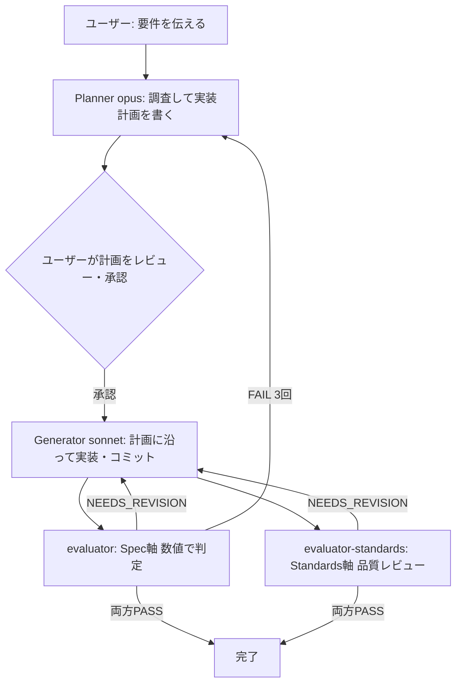
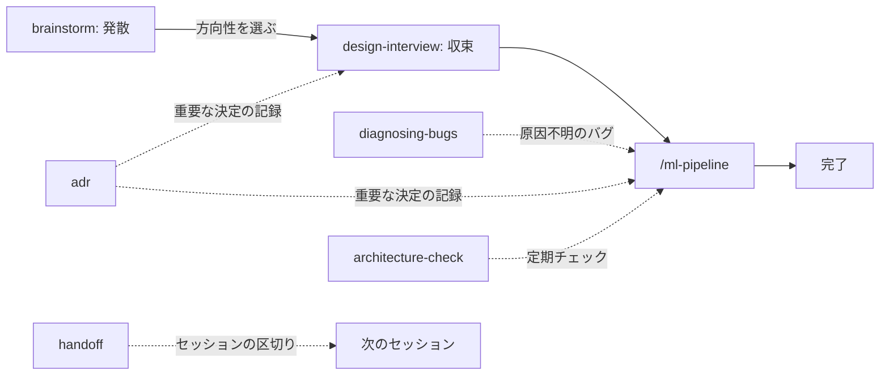

# claude-ml-template

Claude Code で ML・研究系プロジェクトを安全に回すためのテンプレート。
Planner / Generator / Evaluator の役割分離パターンを軸に、スキル(ワークフロー補助)と
フック(物理ガード)を組み合わせて構成する。



役割を分ける理由: 1体に「計画・実装・自己採点」を全部やらせると同じ視点で採点してしまい、
自分の間違いに気づけない。役割ごとに視点を変えることで問題を検出しやすくする。

---

## 0. 迷ったら(エントリーポイントの選び方)

| 状況 | 使うもの |
|---|---|
| 何をしたいか決まっていて、正しさ・再現性が重要 | `/ml-pipeline <作業ディレクトリ> <やりたいこと>`(2.1節) |
| 設計書(docs/drafts または docs/active)が既にある | `/ml-pipeline <作業ディレクトリ> <設計書パス> の設計書に沿って実装したい`(2.2節) |
| パイプラインの一部だけ・途中からやり直したい | `@planner` / `@generator` / `@evaluator` / `@evaluator-standards` を個別に呼ぶ(2.3節) |
| 方向性がまだ決まっていない | brainstorm スキル(「ブレストして」) |
| ラフな案を仕様に固めたい | design-interview スキル(「詰めて」「grillして」) |
| 原因不明のバグ・性能劣化 | diagnosing-bugs スキル(「原因を調べて」)→ 原因が分かったら `/ml-pipeline` へ |
| 単発リファクタ・ドキュメント編集・軽い調査 | 何も挟まずメインセッションで直接(2.5節) |
| セッションを区切って引き継ぐ | handoff スキル(「handoffして」) |
| テンプレート側の改善をこのプロジェクトに反映したい | `claude-update` を実行する(1節「更新」/4節) |

判断に迷う場合の目安、各要素の詳細は 2〜3節を参照。

---

## 1. セットアップ

### 前提条件

| ツール | 用途 | 確認コマンド |
|---|---|---|
| uv | フックの実行(`uv run python`) | `uv --version` |
| git | テンプレート取得・バージョン管理 | `git --version` |
| Claude Code | 本体 | `claude --version` |

ruff は任意(自動整形用)。無ければ整形がスキップされるだけで他は動く。

### 初回展開

プロジェクトのルートで実行する。

PowerShell (Windows):

```powershell
Invoke-WebRequest -Uri "https://raw.githubusercontent.com/takayoshitoyoda05/claude-ml-template/main/claude-init.ps1" -OutFile "claude-init.ps1"
.\claude-init.ps1
```

bash (WSL/Linux/Git Bash):

```bash
curl -sO https://raw.githubusercontent.com/takayoshitoyoda05/claude-ml-template/main/claude-init.sh
chmod +x claude-init.sh
./claude-init.sh
```

`.claude/`(agents / commands / skills / hooks / settings.json)と `CLAUDE.md`(共通ルール)、
フック設定の雛形 `.claude/settings.local.json` が作られ、`.gitignore` に
`.claude/checkpoints/` / `.claude/settings.local.json` / `**/.claude/spec/` が自動追加される。
対話質問はない。

プロジェクト固有の情報(評価コマンド、データの場所など)は、そのプロジェクト直下の
`CLAUDE.md` に書く(例: `projects/Deep_MIL/CLAUDE.md`)。ドメイン用語が多いプロジェクトは
`templates/CONTEXT.md.template` をコピーして `CONTEXT.md`(用語集)も置く。

### 更新(2回目以降・テンプレート側の改善を反映)

テンプレートリポジトリが更新されたら、各プロジェクトのルートで実行する。

```powershell
Invoke-WebRequest -Uri "https://raw.githubusercontent.com/takayoshitoyoda05/claude-ml-template/main/claude-update.ps1" -OutFile "claude-update.ps1"
.\claude-update.ps1
```

```bash
curl -sO https://raw.githubusercontent.com/takayoshitoyoda05/claude-ml-template/main/claude-update.sh
chmod +x claude-update.sh && ./claude-update.sh
```

更新されるのは `agents` / `commands` / `hooks` / `skills` / `settings.json` のみで、
`.claude/plans/`(実行履歴)とプロジェクト固有の `CLAUDE.md` は保持される。
テンプレートとの差分だけ先に確認したい場合は `doctor` を使う(4.5節)。
運用の全体像(テンプレート改善→push→各プロジェクトで反映)は4節を参照。

### 起動(フックの有効化)

フックによるスコープ制限・評価強制の設定は、claude-init が生成する
`.claude/settings.local.json` の `env` ブロックに書く。Claude Code が起動時に
自動でセッションに注入するため、シェルでの設定は不要。素の `claude` で起動するだけでよい。

```json
{
  "env": {
    "CLAUDE_WORK_SCOPE": "projects/Deep_MIL",
    "CLAUDE_ENFORCE_EVAL": "1",
    "CLAUDE_EVAL_CMD": "uv run python -m pytest projects/Deep_MIL/tests/ -q"
  }
}
```

`settings.local.json` は gitignore 済みで、claude-update でも上書きされない
(プロジェクト固有値の置き場)。値を変えたら claude を再起動する。

このファイルは guard_scope.py の保護対象のため、Claude自身による自動書き込みはできない
(Claudeが自分の作業スコープや評価強制を自己解除できてしまうのを防ぐ意図的な制限)。
中身の下書きだけ欲しい場合は「作業スコープをprojects/Deep_MILにして」のように話しかけると
config-set スキルが貼り付け用のJSONを提示するので、それを手動で保存する。

一時的に値を変えたい場合は、従来どおり claude 起動前のシェルで
`$env:CLAUDE_WORK_SCOPE = "..."` / `export CLAUDE_WORK_SCOPE="..."` と設定してもよい。
ただし settings.local.json 側に同じキーが(空でも)あるとそちらが優先されるため、
シェル方式を使うキーは settings.local.json から削除しておく。

| 変数 | 意味 | 未設定時 |
|---|---|---|
| CLAUDE_WORK_SCOPE | 書き込みを許可する範囲 | カレントディレクトリ基準 |
| CLAUDE_ENFORCE_EVAL | `1` で Stop 時の評価強制ON | 評価強制なし |
| CLAUDE_EVAL_CMD | 評価強制で実行するコマンド | 評価強制なし |
| CLAUDE_COMMIT_STEP_RULE | `1` でコミットメッセージにステップ番号(数字)を強制。他のフラグと同様 `settings.local.json` に恒久設定する(セッション起動時にのみ読み込まれるため、`/ml-pipeline` 実行中だけ自動でONにする仕組みは無い) | チェックなし |
| CLAUDE_SPEC_CHECK | `1` で Stop 時に設計書の受け入れ条件を機械検査(spec-compliance)ON | チェックなし |
| CLAUDE_SPEC_RECHECK_N | spec-compliance でauto要件から再実行する件数。`all` で全件 | `3` |

未設定でも動作はする(フックの保護が弱まるだけ)。

### spec-compliance(設計書適合チェック)

設計書(docs/active/)の「## 受け入れ条件」テーブルを唯一の要件ソースとして、
Stop フックと CI で「全要件PASS+承認+独立監査」を機械検査する仕組み。
「LLMの自己申告」ではなく、ID・フック・テスト・独立視点(spec-auditor)の
構造で実装漏れを塞ぐ。

使い方:

1. 設計書に design-interview / brainstorm を通じて「## 受け入れ条件」テーブル
   (ID/要件/検証方法/期待結果/種別/対象の6列)を作る(無いと Planner が差し戻す)。
2. `.claude/settings.local.json` の `env` に `CLAUDE_SPEC_CHECK: "1"` を設定する。
3. `/ml-pipeline` の evaluator が要件IDごとの判定を `.claude/spec/verdict-*.md` に、
   spec-auditor が監査結果を `.claude/spec/audit-*.md` に出力する。
4. manual要件(種別が manual)は、ユーザーが以下を実行して承認するまで通らない。
   Claude 経由では `approvals.txt` を書き換えられず(保護パス)、`spec_approve.py`
   自体の実行も guard_bash がブロックする(承認はユーザーの `!` 実行のみ)。

   ```
   ! uv run python .claude/hooks/spec_approve.py R-003
   ```

   承認時には、その設計書の内容ハッシュも `design_hashes.txt`(同じく保護パス)に
   記録される。manual要件を持たない設計書は、計画承認としてハッシュのみ記録する。

   ```
   ! uv run python .claude/hooks/spec_approve.py --design <設計書名>
   ```

5. Stop 時に `spec_gate` フックが全要件を検査し、欠けがあれば完了をブロックする。
   このとき各設計書のハッシュを承認記録と照合し、未承認・承認後の改変
   (「唯一の要件ソース」の書き換え・検証コマンドの無害化など)も検知してブロックする
   (exit 2)。push 後は CI の `spec_gate.py --ci` が最終ゲートになる
   (`.github/workflows/spec-gate.yml`、claude-init/update が自動配置)。

`.claude/spec/` はローカル運用のため `.gitignore` に `**/.claude/spec/` として自動追加される
(`CLAUDE_WORK_SCOPE` 設定時は作業スコープ配下の `.claude/spec/` が使われるため、任意の深さを除外)。
verdict/audit/approvals/design_hashes はコミット対象外で、CI は auto要件の再実行と coverage 検査のみで判定する。

---

## 2. 使い方

### 2.1 全体フロー: /ml-pipeline

```
/ml-pipeline <作業ディレクトリ> <やりたいこと>
```

例:

```
/ml-pipeline projects/Deep_MIL attention可視化のバグを直したい。
outputs/に出る画像が真っ黒になる問題を解消したい
```

作業ディレクトリを冒頭で指定すると、その配下だけを対象に全エージェントが動く。
複数プロジェクト(`papers/` `slides/` など)が同居するリポジトリでも誤爆しない。
指定しなければ着手前に確認される。

パイプラインの内部では、次のエージェントがこの順序で自動的に呼ばれる
(各エージェントの詳細は 2.3 節を参照)。

1. 作業スコープ直下の `CONTEXT.md` をメイン会話が一度だけ読み、要点を各エージェントに渡す
2. 調査範囲が広ければ **Planner(opus)** の前に Explore(haiku)で安価に下調べする
3. **Planner(opus)** が計画を `.claude/plans/` に保存 → ユーザーが承認するまで次に進まない
4. **Generator(sonnet)** が計画通りに実装・コミット。変更ファイル一覧を両 Evaluator に渡す
5. **evaluator(sonnet)** と **evaluator-standards(sonnet)** が並行して2軸レビュー
   (Spec軸: 動作の正しさ / Standards軸: コード品質)
6. 両方 PASS で完了。片方でも NEEDS_REVISION なら Generator に差し戻し、
   evaluator が FAIL を3回出したら Planner まで巻き戻る。最大3イテレーションで打ち切り

### 2.2 設計書を渡して実装させる

```
/ml-pipeline projects/Deep_MIL docs/drafts/20260703_attention_mil.md の設計書に沿って実装したい
```

設計書は3段階のライフサイクルで自動整理される。

```
docs/drafts/   検討中      ← brainstorm / design-interview で作る・磨く
docs/active/   実装中      ← Planner が計画作成時に drafts から移動
docs/archive/  完了・ボツ  ← evaluator が PASS 時に日付付きで移動
```

### 2.3 エージェントを個別に呼ぶ(リファレンス)

`/ml-pipeline` を通さず `@名前` で1体だけ呼べる。パイプラインの途中からやり直したいとき、
一部の工程だけ使いたいときに便利。個別に呼ぶ場合も
planner → (ユーザー承認) → generator → evaluator / evaluator-standards の順を保つと、
`/ml-pipeline` と同じ品質ゲートになる。

モデル配分の理由: 計画は深い推論が必要なので Opus、実装とレビューは読解と実行確認が
中心なので Sonnet。全部 Opus はコストが跳ね、全部 Haiku は計画品質が落ちる。

#### @planner — 計画を立てる(opus)

```
@planner projects/Deep_MIL で attention の集約を gated attention に変える計画を立てて
```

- **渡すもの**: やりたいこと + 作業ディレクトリ。設計書があればそのパスも
- **すること**: 調査してから実装計画を書く。コードは書かない。技術詳細を詰めすぎず
  判断余地を Generator に残す。トレードオフを伴う決定が含まれると ADR の記録を提案してくる
- **出力**: `.claude/plans/YYYYMMDD-<topic>.md`(目的 / 現状分析 / 変更対象 / 実装手順 / 検証方法 / リスク)
- **備考**: 設計書(`docs/drafts/`)を渡すと `docs/active/` へ移動してから計画を作る
- **単体で呼ぶ場面**: 計画だけ先に固めて、実装は別セッション・別担当に任せたいとき

#### @generator — 計画通りに実装する(sonnet)

```
@generator .claude/plans/20260703-gated-attention.md の計画通りに実装して
```

- **渡すもの**: 計画ファイルのパス(省略すると `.claude/plans/` から該当するものを探す)
- **すること**: 計画に沿った実装。編集は自動承認(`permissionMode: acceptEdits`)で進むが、
  スコープ外への書き込みはフックが物理ブロックする
- **出力**: 実装 + 論理的変更ごとの git commit + 計画ファイル末尾の作業ログ + 変更ファイル一覧
- **単体で呼ぶ場面**: 計画は承認済みで、実装だけやり直したい・別ブランチで再実行したいとき

#### @evaluator — 計画通りに動くか数値で判定する(Spec軸 / sonnet)

```
@evaluator 直近の変更を .claude/plans/20260703-gated-attention.md の検証方法で評価して
```

- **渡すもの**: 計画ファイルのパス。変更ファイル一覧があれば diff の確認範囲が絞られる
- **すること**: 計画の評価コマンドを実際に実行し、期待値と数値で照合。「たぶん合っている」では通さない
- **出力**: PASS / NEEDS_REVISION / FAIL の判定と重大度つき指摘。PASS 時は設計書の
  `docs/archive/` への移動と `docs/EXPERIMENT_LOG.md` への記録も行う。受け入れ条件テーブルが
  あれば `.claude/spec/verdict-*.md` も出力(spec-compliance、1節参照)
- **単体で呼ぶ場面**: 実装は既に終わっていて、評価だけやり直したいとき

#### @evaluator-standards — コード品質をレビューする(Standards軸 / sonnet)

```
@evaluator-standards 直近の変更のコード品質をレビューして
```

- **渡すもの**: 変更ファイル一覧(または作業ディレクトリ)
- **すること**: 可読性・型安全性・重複・一貫性・エラーハンドリングのレビュー(ruff があれば併用)。
  動作の正しさは判定しない(evaluator と独立した視点を保つため)
- **出力**: PASS / NEEDS_REVISION。HIGH / MEDIUM の指摘が無ければ PASS
- **単体で呼ぶ場面**: 動作確認は済んでいて、品質観点のレビューだけ欲しいとき

#### spec-auditor — spec-compliance の独立監査(sonnet)

`/ml-pipeline` 内で `CLAUDE_SPEC_CHECK=1` のときに自動的に呼ばれる。単体呼び出しは
基本的に想定しない(evaluator の自己申告を独立コンテキストで検証する役割のため)。

- **すること**: verdict の証拠検証・スコープ外変更の列挙。evaluator の判定を鵜呑みにしない
- **出力**: `.claude/spec/audit-*.md`

### 2.4 典型的な流れ(スキルとの組み合わせ)



毎回全部を踏む必要はない。設計が固まっているなら `/ml-pipeline` から始めてよい。
スキル一覧は 3.2 節を参照。

### 実例: アイデア出しから完了まで

「Deep_MIL に attention 可視化を追加したい、が方式は決めきれていない」場合の流れ。

1. **起動**: `.claude/settings.local.json` の `env` に作業スコープ等を設定し、`claude` を起動
2. **発散**: 「attention 可視化の方式についてブレストしたい」 → brainstorm スキルが
   `ideas/` に候補を列挙。良さそうな方向を1つ選ぶ
3. **収束**: 「この案を詰めて」 → design-interview スキルが一問一答で仕様を固め、
   `docs/drafts/20260703_attention_viz.md` を作る
4. **実装依頼**: `/ml-pipeline projects/Deep_MIL docs/drafts/20260703_attention_viz.md の設計書に沿って実装したい`
5. **計画レビュー**: Planner が `.claude/plans/` に計画を保存して提示してくる。
   内容を確認して承認する(ここが人間の主な介入ポイント)
6. **実装〜評価**: Generator が実装・コミットし、evaluator(数値)と
   evaluator-standards(品質)が自動でレビュー。NEEDS_REVISION なら Generator に差し戻される
7. **完了**: 両方 PASS で設計書が `docs/archive/` へ移動し、`docs/EXPERIMENT_LOG.md` に記録が残る
8. **区切る**: 続きを別セッションでやるなら「handoffして」で引き継ぎ文書を作る

設計が既に固まっているなら 1 → 4 に直行、原因不明のバグなら 4 の前に
「原因を調べて」(diagnosing-bugs)を挟む、という省略・差し替えができる。

### 2.5 使いどころの目安(コスト感覚)

多エージェント構成は単一セッションよりトークン消費が数倍になる。
「これが間違っていたら困るか?」で判断する。

- 向いている: 結果の正しさが重要な変更、実装バージョン間の食い違い解消、再現性がかかった変更
- 向いていない: 単発リファクタ、ドキュメント編集、軽い調査 → メインセッションだけで十分

---

## 3. 構成要素リファレンス

エージェント個別の使い方は 2.3 節に一元化した。ここでは agents/skills/hooks 全体の
位置づけと、hooks・output style の詳細を扱う。

### 3.1 エージェント(.claude/agents/)一覧

独立したコンテキストで動く実行者。モデル・ツールを個別に指定できる。使い方・呼び出し例は 2.3 節。

| 名前 | model | 役割 |
|---|---|---|
| planner | opus | 調査・実装計画の作成。`.claude/plans/` に計画を保存 |
| generator | sonnet | 計画に沿った実装と git commit |
| evaluator | sonnet | Spec軸: 計画通りに動くか。評価コマンドを実行し数値で判定 |
| evaluator-standards | sonnet | Standards軸: 規約・可読性・型安全性・コードスメル |
| spec-auditor | sonnet | spec-compliance の独立監査: verdict の証拠検証・スコープ外変更の列挙 |

### 3.2 スキル(.claude/skills/)

今の会話に手順を差し込む補助。エージェントと違い独立コンテキストを持たない。

| 名前 | いつ使うか | 出力 |
|---|---|---|
| brainstorm | 方向性が定まっていない(発散) | `ideas/` にアイデア一覧 |
| design-interview | ラフな設計書を一問一答で固める(収束) | `docs/drafts/` の設計書を更新 |
| diagnosing-bugs | 原因不明のバグを再現→仮説→計測で診断 | 診断ログ、原因の特定 |
| tdd | 入出力が明確な新機能を red-green-refactor で | テストファーストの実装 |
| adr | トレードオフを伴う設計判断の記録 | `docs/adr/` に ADR |
| handoff | セッションを区切って引き継ぐ | `.claude/handoffs/` に引き継ぎ文書 |
| architecture-check | 設計負債(重複・肥大化)の定期チェック | レポートのみ(コード変更なし) |
| config-explain | 環境変数の設定源(settings.local.json / シェル)の可視化 | 報告のみ |
| config-set | settings.local.json に書く値を自然文の指示から下書き生成(ファイルはユーザーが手動で保存) | JSON下書きの提示のみ |
| regression-suite | 影響範囲を広くカバーするテストの生成・実行(明示呼び出しのみ) | テスト追加・実行結果 |

いずれも「ブレストして」「grillして」「原因を調べて」のような自然文で発動する。

### 3.3 Output style(.claude/output-styles/)

Anthropic公式の「Prompting Claude Fable 5」ガイドに基づき、Fable 5の行動様式
(結論先行・即行動・進捗の実証・スコープ規律)をSonnet/Opusに移植する。

- メインセッション用: `fable-like.md`。`/config` → Output style → fable-like で有効化。
  有効化はプロジェクトの settings.local.json に保存され、/clear か新セッションで反映される
- サブエージェントには output style が効かないため、planner / generator / evaluator /
  evaluator-standards の各定義に凝縮版を直接埋め込み済み(evaluator系にはレビュー範囲を
  狭めないための注意書き付き)

移植できるのは行動様式のみ。Fable 5自体の推論力は移植できない。

### 3.4 フック(.claude/hooks/)

プロンプトの「お願い」と違い、確定的に実行される物理ガード。
`.claude/settings.json` で配線され、全て `uv run python` 経由で OS を問わず動く。

| フック | イベント | 役割 |
|---|---|---|
| guard_scope.py | PreToolUse (Edit/Write/NotebookEdit) | スコープ外・生成物(`.pth` 等)・秘密情報ファイル・APIキーらしき内容・フック/設定自身への書き込みをブロック |
| guard_bash.py | PreToolUse (Bash/PowerShell) | 危険コマンド(`rm -rf /` / `Remove-Item -Recurse -Force` 等の表記ゆれ、強制push等)、一括ステージ(`git add .` / `-A` / `-u`)、秘密情報の `git add`、フック/設定/承認記録を変更するコマンド(`cp`/`mv`/`sed -i`/`rm` や `Copy-Item`/`Move-Item`/`Set-Content`/`Remove-Item` 等のPowerShell変更系コマンド、リダイレクト/tee 等)、`spec_approve.py` のエージェント経由実行、コミット規約(フラグON時)をブロック。コマンド名の判定は大文字小文字を区別しない(PowerShellのエイリアス対応) |
| auto_format.py | PostToolUse (Edit/Write/NotebookEdit) | `.py` 編集後に `ruff format`(ruff が無ければスルー) |
| enforce_eval.py | Stop | 評価コマンドを実行し失敗なら続行を促す(フラグON時のみ)。前回PASSから状態が変わっていなければ再実行をスキップ |
| spec_gate.py | Stop | `CLAUDE_SPEC_CHECK=1` のとき、設計書の受け入れ条件テーブルを全要件PASS・承認・監査OK・設計書ハッシュ一致(計画承認時点からの改変検知)で検査し、欠けがあればブロック(`--ci` でCIモード: auto再実行+coverageのみ) |
| checkpoint_before_compact.py | PreCompact | 圧縮直前に git 状態・トランスクリプトを `.claude/checkpoints/` にバックアップ(直近10世代のみ保持) |
| reinject_after_compact.py | SessionStart (compact) | 圧縮直後にチェックポイントと注意事項を会話に再注入 |

`spec_approve.py` はフックとして配線されず、ユーザーが `!` で手動実行する
専用スクリプト(manual要件の承認記録と設計書ハッシュの計画承認記録用)。
エージェントの Bash/PowerShell ツール経由の実行は guard_bash がブロックする
(ユーザーの `!` 実行は PreToolUse フックを通らないため影響しない)。

秘密情報・生成物・保護パスの検知パターンは `_common.py` に一元化されており、guard 系フックで共有される。

`.claude/hooks/` と `settings.json` / `settings.local.json` はガード自身の自己書き換え防止のため、
Claude 経由では編集できない(Edit/Write・リダイレクト・tee をブロック)。フックや設定を変更
したいときは、エディタ等でユーザーが手動編集する。無効化したい場合も同様に、手動で
`.claude/settings.json` に `"disableAllHooks": true` を追加する。

### 3.5 プロンプトとフックの二重防御

スコープ制約などの重要ルールは、(1) 各エージェントのプロンプトで意図を伝え、
(2) フックで物理的に最終ブロックする、の二段構え。プロンプトだけでは徹底されず、
フックだけでは意図が伝わらないため。

### 3.6 ガードの守備範囲と限界(重要)

これらのフックは **多層防御(事故と単純な逸脱を止める補助線)** であって、
任意コード実行に対する完全なセキュリティ境界ではない。Bash から
`python -c "open('.claude/settings.json','w')..."` のように任意の
インタプリタを起動する経路や、名前指定の `find -delete` までは
正規表現ベースの検査で塞ぎきれない(いたちごっこになる)。
保護パス(`.claude/hooks/` と `settings.json` 系・`.claude/spec/approvals.txt`・
`.claude/spec/last_spec_pass.txt`・`.claude/spec/design_hashes.txt`)の
本当の防壁は「**変更はユーザーが手動で行う**」という運用であり、フックは
`cp`/`mv`/`sed`/`rm`/`Remove-Item`/`Copy-Item`/リダイレクト等のよく使う直接的な手段を
塞いで補助する位置づけと理解しておくこと。

---

## 4. テンプレートの育て方

1. 実プロジェクトで使い、「Plannerの指示がずれた」「Evaluatorが甘い」などの気づきを得る
2. 他プロジェクトでも通用する改善だけを、このテンプレートリポジトリの該当ファイルに反映して push
3. 各プロジェクトで `claude-update` を実行し、改善を波及させる

```powershell
Invoke-WebRequest -Uri "https://raw.githubusercontent.com/takayoshitoyoda05/claude-ml-template/main/claude-update.ps1" -OutFile "claude-update.ps1"
.\claude-update.ps1
```

```bash
curl -sO https://raw.githubusercontent.com/takayoshitoyoda05/claude-ml-template/main/claude-update.sh
chmod +x claude-update.sh && ./claude-update.sh
```

更新されるのは `agents` / `commands` / `hooks` / `skills` / `settings.json` のみ。
`.claude/plans/`(実行履歴)とプロジェクト固有の `CLAUDE.md` は保持される。
そのプロジェクトだけの特殊事情はローカルの `.claude/` を直接編集し、テンプレートには戻さない。

### push 前のフック検証

フックを変更したら、push 前にテストを一括実行する。

```
.\verify-hooks.ps1        # PowerShell
./verify-hooks.sh         # bash
```

## 4.5 その他のツール

### doctor(テンプレートとの差分確認)
プロジェクト側がテンプレートの最新版からどれだけ差分があるか確認する。
.\doctor.ps1        # PowerShell
./doctor.sh          # bash

差分があれば claude-update の実行を検討する。

### CI
push / PR のたびに GitHub Actions で verify-hooks が自動実行される。
フックを変更したらローカルでも `.\verify-hooks.ps1` で確認してからpushする。

---

## 5. トラブルシューティング

### 文字化け(nvim 編集時)

- 編集前に `:set fileencoding=utf-8` と `:set fileformat=unix`
- 既に化けたファイルはエディタでは直らないことが多い。PowerShell の
  `[System.IO.File]::WriteAllText(...)` 等で書き直す
- `.sh` は BOM 付きだとシェバンが壊れる。BOM なし UTF-8 で保存する
- `.gitattributes` で `*.sh` `*.py` を `eol=lf` に固定済み(環境をまたぐ改行事故の防止)

### Get-Content で日本語が化ける

PowerShell 5.1 系は BOM なし UTF-8 を Shift-JIS として誤読することがある。
ファイル自体は壊れていないことが多い。

```powershell
Get-Content ファイル名 -Encoding UTF8
```

### PowerShell で bash 構文がエラーになる

- `mkdir -p a b c` → `New-Item -ItemType Directory -Path "a", "b", "c" -Force`
- ヒアドキュメント → `@'...'@`(閉じ側は行頭に置く)

### ブランチ名が master のまま

```powershell
git branch -M main
```

---

## 6. ファイル一覧

```
claude-ml-template/
  .claude/
    agents/
      planner.md                    Opus / 計画立案専任
      generator.md                  Sonnet / 実装専任、acceptEdits
      evaluator.md                  Sonnet / Spec軸レビュー、実験ログ記録
      evaluator-standards.md        Sonnet / Standards軸(コード品質)レビュー
      spec-auditor.md                Sonnet / spec-compliance独立監査(証拠検証・スコープ外変更列挙)
    commands/
      ml-pipeline.md                エージェントを繋ぐフロー制御
    skills/
      brainstorm/                   発散(アイデア出し)
      design-interview/             収束(設計の一問一答)
      diagnosing-bugs/              バグ診断ループ
      tdd/                          テスト駆動開発
      adr/                          設計決定の記録
      handoff/                      セッション引き継ぎ
      architecture-check/           設計負債チェック
      config-explain/               スコープ・評価強制設定の可視化
      config-set/                   settings.local.json 用JSON下書きの生成(保存はユーザーが手動)
      regression-suite/             回帰テストスイート生成(明示呼び出しのみ)
    hooks/
      _common.py                    guard系で共有する検知パターン・保護パス定義
      guard_scope.py                スコープ外・秘密情報・フック自己書き換えのブロック
      guard_bash.py                 危険コマンド・git add・リダイレクト/tee のガード
      auto_format.py                ruff format 自動実行
      enforce_eval.py               評価コマンド実行強制(状態不変ならスキップ)
      spec_gate.py                  Stop: 設計書の受け入れ条件を機械検査(--ci でCIモード)
      spec_approve.py               manual要件の承認・設計書ハッシュの計画承認記録(ユーザーの`!`実行専用。エージェント経由の実行はguard_bashがブロック)
      checkpoint_before_compact.py  圧縮前バックアップ(直近10世代のみ保持)
      reinject_after_compact.py     圧縮後の再注入
    settings.json                   フックの配線
  .github/workflows/
    verify-hooks.yml                CI: push/PR時のフック自動テスト
    spec-gate.yml                   CI: push/PR時にspec_gate.py --ciを実行(init/updateが配置)
  templates/
    CLAUDE.md.template              プロジェクト共通ルールの雛形
    ADR.md.template                 ADR の雛形
    CONTEXT.md.template             ドメイン用語集の雛形
    settings.local.json.template    フック用環境変数の雛形(init/update が展開)
    spec-gate.yml.template          spec-gate CIワークフローの雛形(init/update が配置)
  claude-init.ps1 / .sh             初回セットアップ
  claude-update.ps1 / .sh           更新(agents/commands/hooks/skills/settings.json)
  verify-hooks.ps1 / .sh            フックの自動テスト
  doctor.ps1 / .sh                  テンプレートとの差分確認
  CHANGELOG.md                      変更履歴
  LICENSE                           MIT
  .gitattributes                    改行コード固定(*.sh, *.py を LF に)
  .gitignore                        .claude/checkpoints/ 等を除外
```


## 謝辞

スキルの一部は [mattpocock/skills](https://github.com/mattpocock/skills)(MIT License)を
参考にしています。特に design-interview は同リポジトリの grilling スキルを元に、
日本語・ML研究ワークフロー向けに再構成したものです。
