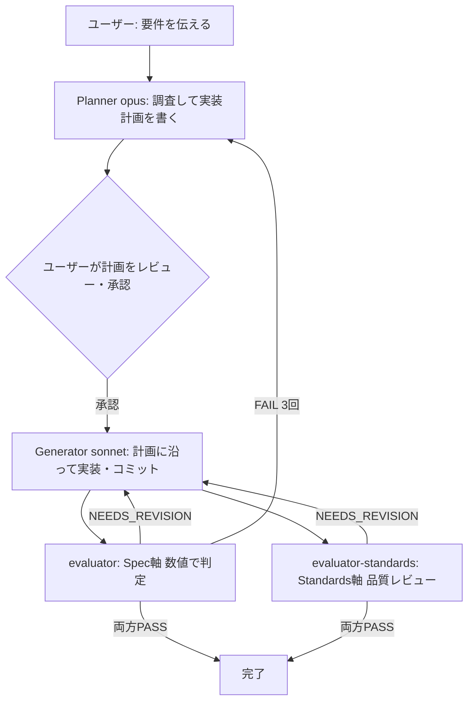
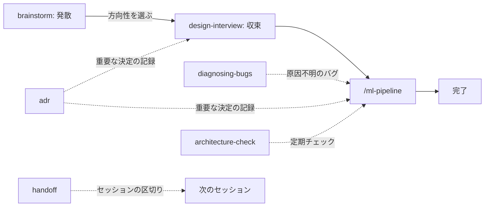

# claude-ml-template

Claude Code で ML・研究系プロジェクトを安全に回すためのテンプレート。
Planner / Generator / Evaluator の役割分離パターンを軸に、スキル(ワークフロー補助)と
フック(物理ガード)を組み合わせて構成する。



役割を分ける理由: 1体に「計画・実装・自己採点」を全部やらせると同じ視点で採点してしまい、
自分の間違いに気づけない。役割ごとに視点を変えることで問題を検出しやすくする。

---

## 1. セットアップ

### 前提条件

| ツール | 用途 | 確認コマンド |
|---|---|---|
| uv | フックの実行(`uv run python`) | `uv --version` |
| git | テンプレート取得・バージョン管理 | `git --version` |
| Claude Code | 本体 | `claude --version` |

ruff は任意(自動整形用)。無ければ整形がスキップされるだけで他は動く。

### 初回展開

プロジェクトのルートで実行する。

PowerShell (Windows):

```powershell
Invoke-WebRequest -Uri "https://raw.githubusercontent.com/takayoshitoyoda05/claude-ml-template/main/claude-init.ps1" -OutFile "claude-init.ps1"
.\claude-init.ps1
```

bash (WSL/Linux/Git Bash):

```bash
curl -sO https://raw.githubusercontent.com/takayoshitoyoda05/claude-ml-template/main/claude-init.sh
chmod +x claude-init.sh
./claude-init.sh
```

`.claude/`(agents / commands / skills / hooks / settings.json)と `CLAUDE.md`(共通ルール)が
作られ、`.gitignore` に `.claude/checkpoints/` が自動追加される。対話質問はない。

プロジェクト固有の情報(評価コマンド、データの場所など)は、そのプロジェクト直下の
`CLAUDE.md` に書く(例: `projects/Deep_MIL/CLAUDE.md`)。ドメイン用語が多いプロジェクトは
`templates/CONTEXT.md.template` をコピーして `CONTEXT.md`(用語集)も置く。

### 起動(環境変数でフックを有効化)

フックによるスコープ制限・評価強制を効かせるには、claude 起動前にシェルで設定する。

```powershell
$env:CLAUDE_WORK_SCOPE = "projects/Deep_MIL"
$env:CLAUDE_ENFORCE_EVAL = "1"
$env:CLAUDE_EVAL_CMD = "uv run python -m pytest projects/Deep_MIL/tests/ -q"
claude
```

```bash
export CLAUDE_WORK_SCOPE="projects/Deep_MIL"
export CLAUDE_ENFORCE_EVAL="1"
export CLAUDE_EVAL_CMD="uv run python -m pytest projects/Deep_MIL/tests/ -q"
claude
```

| 変数 | 意味 | 未設定時 |
|---|---|---|
| CLAUDE_WORK_SCOPE | 書き込みを許可する範囲 | カレントディレクトリ基準 |
| CLAUDE_ENFORCE_EVAL | `1` で Stop 時の評価強制ON | 評価強制なし |
| CLAUDE_EVAL_CMD | 評価強制で実行するコマンド | 評価強制なし |
| CLAUDE_COMMIT_STEP_RULE | `1` でコミットメッセージにステップ番号(数字)を強制。`/ml-pipeline` 実行時のみONにする想定 | チェックなし |

未設定でも動作はする(フックの保護が弱まるだけ)。

---

## 2. 使い方

### 基本: /ml-pipeline

```
/ml-pipeline <作業ディレクトリ> <やりたいこと>
```

例:

```
/ml-pipeline projects/Deep_MIL attention可視化のバグを直したい。
outputs/に出る画像が真っ黒になる問題を解消したい
```

作業ディレクトリを冒頭で指定すると、その配下だけを対象に全エージェントが動く。
複数プロジェクト(`papers/` `slides/` など)が同居するリポジトリでも誤爆しない。
指定しなければ着手前に確認される。

パイプラインの中では次のことが自動で行われる。

1. 作業スコープ直下の `CONTEXT.md` をメイン会話が一度だけ読み、要点を各エージェントに渡す
2. 調査範囲が広ければ Planner(Opus)の前に Explore(Haiku)で安価に下調べする
3. Planner の計画はユーザー承認があるまで実装に進まない
4. Generator の変更ファイル一覧を両 Evaluator に渡し、diff の確認範囲を絞る
5. 2軸レビュー(Spec / Standards)が両方 PASS で完了。最大3イテレーションで打ち切り

### 設計書を渡して実装させる

```
/ml-pipeline projects/Deep_MIL docs/drafts/20260703_attention_mil.md の設計書に沿って実装したい
```

設計書は3段階のライフサイクルで自動整理される。

```
docs/drafts/   検討中      ← brainstorm / design-interview で作る・磨く
docs/active/   実装中      ← Planner が計画作成時に drafts から移動
docs/archive/  完了・ボツ  ← evaluator が PASS 時に日付付きで移動
```

### エージェントを個別に呼ぶ

```
@planner この関数の設計を考えて
@generator この計画通りに実装して
@evaluator 直近の変更をレビューして
```

### 典型的な流れ(スキルとの組み合わせ)



毎回全部を踏む必要はない。設計が固まっているなら `/ml-pipeline` から始めてよい。

### 使いどころの目安(コスト感覚)

多エージェント構成は単一セッションよりトークン消費が数倍になる。
「これが間違っていたら困るか?」で判断する。

- 向いている: 結果の正しさが重要な変更、実装バージョン間の食い違い解消、再現性がかかった変更
- 向いていない: 単発リファクタ、ドキュメント編集、軽い調査 → メインセッションだけで十分

---

## 3. 構成要素リファレンス

### エージェント(.claude/agents/)

独立したコンテキストで動く実行者。モデル・ツールを個別に指定できる。

| 名前 | model | 役割 | 備考 |
|---|---|---|---|
| planner | opus | 調査・実装計画の作成。`.claude/plans/` に計画を保存 | コードは書かない。技術詳細を詰めすぎず判断余地を Generator に残す |
| generator | sonnet | 計画に沿った実装と git commit | `permissionMode: acceptEdits` で編集を自動承認 |
| evaluator | sonnet | Spec軸: 計画通りに動くか。評価コマンドを実行し数値で判定 | PASS 時に設計書アーカイブ・実験ログ記録も行う |
| evaluator-standards | sonnet | Standards軸: 規約・可読性・型安全性・コードスメル | 動作の正しさは判断しない(evaluator と独立) |

モデル配分の理由: 計画は深い推論が必要なので Opus、実装とレビューは読解と実行確認が
中心なので Sonnet。全部 Opus はコストが跳ね、全部 Haiku は計画品質が落ちる。

### スキル(.claude/skills/)

今の会話に手順を差し込む補助。エージェントと違い独立コンテキストを持たない。

| 名前 | いつ使うか | 出力 |
|---|---|---|
| brainstorm | 方向性が定まっていない(発散) | `ideas/` にアイデア一覧 |
| design-interview | ラフな設計書を一問一答で固める(収束) | `docs/drafts/` の設計書を更新 |
| diagnosing-bugs | 原因不明のバグを再現→仮説→計測で診断 | 診断ログ、原因の特定 |
| tdd | 入出力が明確な新機能を red-green-refactor で | テストファーストの実装 |
| adr | トレードオフを伴う設計判断の記録 | `docs/adr/` に ADR |
| handoff | セッションを区切って引き継ぐ | `.claude/handoffs/` に引き継ぎ文書 |
| architecture-check | 設計負債(重複・肥大化)の定期チェック | レポートのみ(コード変更なし) |

いずれも「ブレストして」「grillして」「原因を調べて」のような自然文で発動する。

### フック(.claude/hooks/)

プロンプトの「お願い」と違い、確定的に実行される物理ガード。
`.claude/settings.json` で配線され、全て `uv run python` 経由で OS を問わず動く。

| フック | イベント | 役割 |
|---|---|---|
| guard_scope.py | PreToolUse (Edit/Write) | スコープ外・生成物(`.pth` 等)・秘密情報ファイル・APIキーらしき内容の書き込みをブロック |
| guard_bash.py | PreToolUse (Bash) | 危険コマンド(`rm -rf /` 等)、秘密情報の `git add`・リダイレクト書き込み、コミット規約(フラグON時)をブロック |
| auto_format.py | PostToolUse (Edit/Write) | `.py` 編集後に `ruff format`(ruff が無ければスルー) |
| enforce_eval.py | Stop | 評価コマンドを実行し失敗なら続行を促す(フラグON時のみ)。前回PASSから状態が変わっていなければ再実行をスキップ |
| checkpoint_before_compact.py | PreCompact | 圧縮直前に git 状態・トランスクリプトを `.claude/checkpoints/` にバックアップ |
| reinject_after_compact.py | SessionStart (compact) | 圧縮直後にチェックポイントと注意事項を会話に再注入 |

秘密情報・生成物の検知パターンは `_common.py` に一元化されており、guard 系フックで共有される。

無効化したい場合は `.claude/settings.json` に `"disableAllHooks": true` を追加する。

### プロンプトとフックの二重防御

スコープ制約などの重要ルールは、(1) 各エージェントのプロンプトで意図を伝え、
(2) フックで物理的に最終ブロックする、の二段構え。プロンプトだけでは徹底されず、
フックだけでは意図が伝わらないため。

---

## 4. テンプレートの育て方

1. 実プロジェクトで使い、「Plannerの指示がずれた」「Evaluatorが甘い」などの気づきを得る
2. 他プロジェクトでも通用する改善だけを、このテンプレートリポジトリの該当ファイルに反映して push
3. 各プロジェクトで `claude-update` を実行し、改善を波及させる

```powershell
Invoke-WebRequest -Uri "https://raw.githubusercontent.com/takayoshitoyoda05/claude-ml-template/main/claude-update.ps1" -OutFile "claude-update.ps1"
.\claude-update.ps1
```

```bash
curl -sO https://raw.githubusercontent.com/takayoshitoyoda05/claude-ml-template/main/claude-update.sh
chmod +x claude-update.sh && ./claude-update.sh
```

更新されるのは `agents` / `commands` / `hooks` / `skills` / `settings.json` のみ。
`.claude/plans/`(実行履歴)とプロジェクト固有の `CLAUDE.md` は保持される。
そのプロジェクトだけの特殊事情はローカルの `.claude/` を直接編集し、テンプレートには戻さない。

### push 前のフック検証

フックを変更したら、push 前にテストを一括実行する。

```
.\verify-hooks.ps1        # PowerShell
./verify-hooks.sh         # bash
```

---

## 5. トラブルシューティング

### 文字化け(nvim 編集時)

- 編集前に `:set fileencoding=utf-8` と `:set fileformat=unix`
- 既に化けたファイルはエディタでは直らないことが多い。PowerShell の
  `[System.IO.File]::WriteAllText(...)` 等で書き直す
- `.sh` は BOM 付きだとシェバンが壊れる。BOM なし UTF-8 で保存する
- `.gitattributes` で `*.sh` `*.py` を `eol=lf` に固定済み(環境をまたぐ改行事故の防止)

### Get-Content で日本語が化ける

PowerShell 5.1 系は BOM なし UTF-8 を Shift-JIS として誤読することがある。
ファイル自体は壊れていないことが多い。

```powershell
Get-Content ファイル名 -Encoding UTF8
```

### PowerShell で bash 構文がエラーになる

- `mkdir -p a b c` → `New-Item -ItemType Directory -Path "a", "b", "c" -Force`
- ヒアドキュメント → `@'...'@`(閉じ側は行頭に置く)

### ブランチ名が master のまま

```powershell
git branch -M main
```

---

## 6. ファイル一覧

```
claude-ml-template/
  .claude/
    agents/
      planner.md                    Opus / 計画立案専任
      generator.md                  Sonnet / 実装専任、acceptEdits
      evaluator.md                  Sonnet / Spec軸レビュー、実験ログ記録
      evaluator-standards.md        Sonnet / Standards軸(コード品質)レビュー
    commands/
      ml-pipeline.md                エージェントを繋ぐフロー制御
    skills/
      brainstorm/                   発散(アイデア出し)
      design-interview/             収束(設計の一問一答)
      diagnosing-bugs/              バグ診断ループ
      tdd/                          テスト駆動開発
      adr/                          設計決定の記録
      handoff/                      セッション引き継ぎ
      architecture-check/           設計負債チェック
    hooks/
      _common.py                    guard系で共有する検知パターン定義
      guard_scope.py                スコープ外・秘密情報書き込みブロック
      guard_bash.py                 危険コマンド・git add・リダイレクトのガード
      auto_format.py                ruff format 自動実行
      enforce_eval.py               評価コマンド実行強制(状態不変ならスキップ)
      checkpoint_before_compact.py  圧縮前バックアップ
      reinject_after_compact.py     圧縮後の再注入
    settings.json                   フックの配線
  templates/
    CLAUDE.md.template              プロジェクト共通ルールの雛形
    ADR.md.template                 ADR の雛形
    CONTEXT.md.template             ドメイン用語集の雛形
  claude-init.ps1 / .sh             初回セットアップ
  claude-update.ps1 / .sh           更新(agents/commands/hooks/skills のみ)
  verify-hooks.ps1 / .sh            フックの自動テスト
  .gitattributes                    改行コード固定(*.sh, *.py を LF に)
  .gitignore                        .claude/checkpoints/ 等を除外
```
