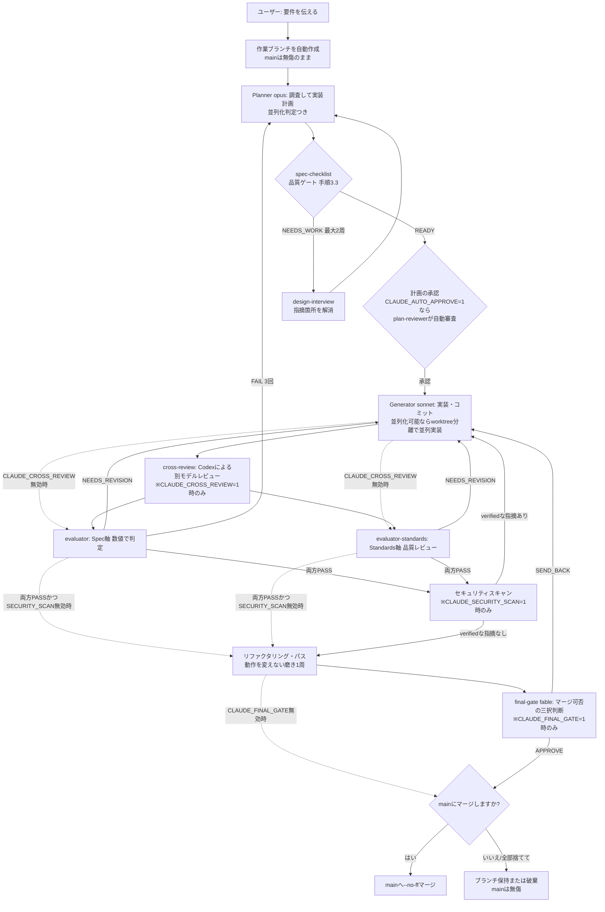
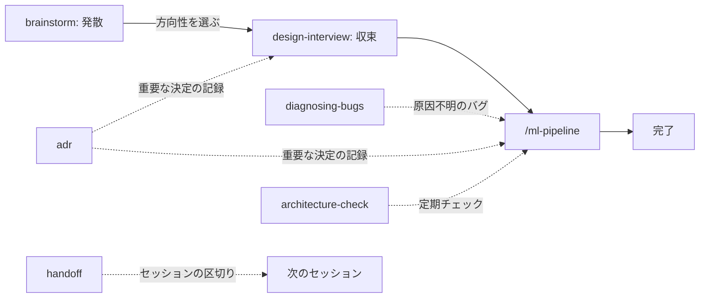

# claude-ml-template

Claude Code で ML・研究系プロジェクトを安全に回すためのテンプレート。
Planner / Generator / Evaluator の役割分離パターンを軸に、スキル(ワークフロー補助)と
フック(機械ガード)を組み合わせて構成する。



このほか Stop 時には機械ゲート(評価強制 / spec適合 / Codexレビュー必須化 /
品質チェック / 完了通知)がフラグに応じて働く(3.4節)。

役割を分ける理由: 1体に「計画・実装・自己採点」を全部やらせると同じ視点で採点してしまい、
自分の間違いに気づけない。役割ごとに視点を変えることで問題を検出しやすくする。

---

## 0. 迷ったら(エントリーポイントの選び方)

| 状況 | 使うもの |
|---|---|
| 何をしたいか決まっていて、正しさ・再現性が重要 | `/ml-pipeline <作業ディレクトリ> <やりたいこと>`(2.1節) |
| 設計書(docs/drafts または docs/active)が既にある | `/ml-pipeline <作業ディレクトリ> <設計書パス> の設計書に沿って実装したい`(2.2節) |
| パイプラインの一部だけ・途中からやり直したい | `@planner` / `@generator` / `@evaluator` / `@evaluator-standards` などを個別に呼ぶ(2.3節) |
| 方向性がまだ決まっていない | brainstorm スキル(「ブレストして」) |
| ラフな案を仕様に固めたい | design-interview スキル(「詰めて」「grillして」) |
| 原因不明のバグ・性能劣化 | diagnosing-bugs スキル(「原因を調べて」)→ 原因が分かったら `/ml-pipeline` へ |
| 単発リファクタ・ドキュメント編集・軽い調査 | 何も挟まずメインセッションで直接(2.5節) |
| セッションを区切って引き継ぐ | handoff スキル(「handoffして」) |
| 関連研究を調べたい・サーベイをまとめたい | literature-review スキル(「サーベイして」)(3.15節) |
| 論文原稿のチェック・査読対応・推敲 | paper-writing スキル(「論文をチェックして」)(3.15節) |
| 実験結果の記録・過去実験との比較 | mlflow-log スキル(「実験を記録して」「実験AとBを比較して」)(3.15節) |
| 定型作業(テスト量産・一括変換)を Codex に任せたい | codex-delegate スキル(「Codexにやらせて」)(3.10節) |
| テンプレート側の改善をこのプロジェクトに反映したい | `claude-update` を実行する(1節「更新」/4節) |

判断に迷う場合の目安、各要素の詳細は 2〜3節を参照。

---

## 1. セットアップ

### 前提条件

| ツール | 用途 | 確認コマンド |
|---|---|---|
| uv | フックの実行(`uv run python`) | `uv --version` |
| git | テンプレート取得・バージョン管理 | `git --version` |
| Claude Code | 本体 | `claude --version` |
| Codex CLI(任意) | Codex連携 — cross-review(別モデルレビュー)/ codex-delegate(実装委譲) | `codex --version` |

ruff は任意(自動整形用)。無ければ整形がスキップされるだけで他は動く。
Codex CLI も任意で、`CLAUDE_CROSS_REVIEW=1` のゲートや「Codexにやらせて」を使う
場合のみ必要。インストール後に `codex login` で認証しておくこと(未認証だと
cross-review はスキップ扱いになる)。無くても Codex 連携以外の全機能は動く。

### 初回展開(方法A: claude-init — 推奨・フル機能)

**これが本テンプレートの正式な導入方法。** プロジェクトのルートで1コマンド実行する。

bash (WSL/Linux/Git Bash):

```bash
curl -sSL https://raw.githubusercontent.com/takayoshitoyoda05/claude-ml-template/main/claude-init.sh | bash
```

PowerShell (Windows):

```powershell
Invoke-WebRequest -Uri "https://raw.githubusercontent.com/takayoshitoyoda05/claude-ml-template/main/claude-init.ps1" -OutFile "claude-init.ps1"; .\claude-init.ps1
```

(スクリプトの中身を確認してから実行したい場合は、従来どおりダウンロード→実行の
2段階でもよい)

`.claude/`(agents / commands / skills / hooks / output-styles / rules / settings.json)と
`CLAUDE.md`(共通ルール)、フック設定の雛形 `.claude/settings.local.json` が作られ、
Codex CLI 連携用に `agents/shared/` の配置・`AGENTS.md` の生成・`.codex/`
(config.toml と skills のコピー)も行われる。`.gitignore` に
`.claude/checkpoints/` / `.claude/settings.local.json` / `**/.claude/spec/` / `/.worktrees/`
が自動追加される。対話質問は無い(既存の `.claude` があるプロジェクトで再実行した
場合のみ上書き確認が出る。確認は端末から受け付けるため `curl | bash` でも機能し、
CI 等の非対話環境では上書きせず安全に中止する)。

プロジェクト固有の情報(評価コマンド、データの場所など)は、そのプロジェクト直下の
`CLAUDE.md` に書く(例: `projects/Deep_MIL/CLAUDE.md`)。ドメイン用語が多いプロジェクトは
`templates/CONTEXT.md.template` をコピーして `CONTEXT.md`(用語集)も置く。

### 方法B: プラグインとして導入(実験的・現時点では非推奨)

**立ち位置**: 方法B は将来のプラグイン仕様対応に向けた**実験的な布石**であり、
現時点で実用的な導入手段ではない。本テンプレートの正式な導入・更新経路は
方法A(claude-init / claude-update)で、当面 A を主軸に開発を進める。

理由(B が A を置き換えられない構造的制約):
- 現行のプラグイン仕様はコンポーネント(スキル・フック等)をプラグインルート
  直下に置く前提のため、`.claude/` 配下に置く本テンプレートの構成では
  **プラグイン経由でスキル・フックが読み込まれない**
- CLAUDE.md 生成・.gitignore 自動設定・settings.local.json 雛形・CI 配置・
  Codex 連携(AGENTS.md / .codex/)は「プロジェクト側への書き込み」であり、
  プラグインの仕組みでは扱えない
- ガードの自己防御モデル(フックはユーザーの git 管理下にあり手動編集のみ)は
  リポジトリ内 `.claude/hooks/` を前提としており、プラグイン配布とは相容れない

`.claude-plugin/`(plugin.json / marketplace.json)はこの布石として維持する。
プラグイン仕様が `.claude/` 構成をサポートするか安定した時点で再検討する。

<details>
<summary>実験したい場合のコマンド(自己責任)</summary>

```
/plugin marketplace add takayoshitoyoda05/claude-ml-template
/plugin install claude-ml-template@claude-ml-template
/plugin update claude-ml-template@claude-ml-template
```

</details>

### 更新(2回目以降・テンプレート側の改善を反映)

テンプレートリポジトリが更新されたら、各プロジェクトのルートで実行する。

```powershell
Invoke-WebRequest -Uri "https://raw.githubusercontent.com/takayoshitoyoda05/claude-ml-template/main/claude-update.ps1" -OutFile "claude-update.ps1"
.\claude-update.ps1
```

```bash
curl -sO https://raw.githubusercontent.com/takayoshitoyoda05/claude-ml-template/main/claude-update.sh
chmod +x claude-update.sh && ./claude-update.sh
```

更新されるのは `agents` / `commands` / `hooks` / `skills` / `output-styles` / `rules` /
`settings.json` と、Codex CLI 連携分(`agents/shared/` の配布ファイル・`AGENTS.md` の再生成・
`.codex/skills/` のコピー)。`.claude/plans/`(実行履歴)とプロジェクト固有の `CLAUDE.md` は
保持され、`agents/shared/` や `.codex/skills/` にユーザーが独自に置いたファイルも残る。
テンプレートとの差分だけ先に確認したい場合は `doctor` を使う(4.5節)。
運用の全体像(テンプレート改善→push→各プロジェクトで反映)は4節を参照。

### 起動(フックの有効化)

フックによるスコープ制限・評価強制の設定は、claude-init が生成する
`.claude/settings.local.json` の `env` ブロックに書く。Claude Code が起動時に
自動でセッションに注入するため、シェルでの設定は不要。素の `claude` で起動するだけでよい。

```json
{
  "env": {
    "CLAUDE_WORK_SCOPE": "projects/Deep_MIL",
    "CLAUDE_ENFORCE_EVAL": "1",
    "CLAUDE_EVAL_CMD": "uv run python -m pytest projects/Deep_MIL/tests/ -q"
  }
}
```

`settings.local.json` は gitignore 済みで、claude-update でも上書きされない
(プロジェクト固有値の置き場)。値を変えたら claude を再起動する。

このファイルは guard_scope.py の保護対象のため、Claude自身による自動書き込みはできない
(Claudeが自分の作業スコープや評価強制を自己解除できてしまうのを防ぐ意図的な制限)。
中身の下書きだけ欲しい場合は「作業スコープをprojects/Deep_MILにして」のように話しかけると
config-set スキルが貼り付け用のJSONを提示するので、それを手動で保存する。

一時的に値を変えたい場合は、従来どおり claude 起動前のシェルで
`$env:CLAUDE_WORK_SCOPE = "..."` / `export CLAUDE_WORK_SCOPE="..."` と設定してもよい。
ただし settings.local.json 側に同じキーが(空でも)あるとそちらが優先されるため、
シェル方式を使うキーは settings.local.json から削除しておく。

| 変数 | 意味 | 未設定時 |
|---|---|---|
| CLAUDE_WORK_SCOPE | 書き込みを許可する範囲 | カレントディレクトリ基準 |
| CLAUDE_ENFORCE_EVAL | `1` で Stop 時の評価強制ON | 評価強制なし |
| CLAUDE_EVAL_CMD | 評価強制で実行するコマンド | 評価強制なし |
| CLAUDE_COMMIT_STEP_RULE | `1` でコミットメッセージにステップ番号(数字)を強制。他のフラグと同様 `settings.local.json` に恒久設定する(セッション起動時にのみ読み込まれるため、`/ml-pipeline` 実行中だけ自動でONにする仕組みは無い) | チェックなし |
| CLAUDE_SPEC_CHECK | `1` で Stop 時に設計書の受け入れ条件を機械検査(spec-compliance)ON | チェックなし |
| CLAUDE_SPEC_RECHECK_N | spec-compliance でauto要件から再実行する件数。`all` で全件 | `3` |
| CLAUDE_CROSS_REVIEW | `1` でCodexクロスレビューをevaluator前に必須にする | 無効(0) |
| CODEX_MODEL | Codexのモデルを一時的に上書き(空なら.codex/config.tomlの設定) | 空 |
| CLAUDE_AUTO_APPROVE | `1` で plan-reviewer による計画の自動承認を有効にする | 無効(0) |
| CLAUDE_QUALITY_GATE | `1` でruff/radon/mypyの機械的品質チェックをStopフックで強制する | 無効(0) |
| CLAUDE_NOTIFY | `1` でセッション停止時にデスクトップ通知を出す | 無効(0) |
| CLAUDE_SECURITY_SCAN | `1` でclaude-securityプラグインによる差分スキャンを2軸レビュー後に実行(起動にはユーザー本人のコスト承諾明記が別途必要。3.16節参照) | 無効(0) |
| CLAUDE_FINAL_GATE | `1` でFableによる最終ゲート判断をリファクタパス後に実行 | 無効(0) |

未設定でも動作はする(フックの保護が弱まるだけ)。

### spec-compliance(設計書適合チェック)

設計書(docs/active/)の「## 受け入れ条件」テーブルを唯一の要件ソースとして、
Stop フックと CI で「全要件PASS+承認+独立監査」を機械検査する仕組み。
「LLMの自己申告」ではなく、ID・フック・テスト・独立視点(spec-auditor)の
構造で実装漏れを塞ぐ。

使い方:

1. 設計書に design-interview / brainstorm を通じて「## 受け入れ条件」テーブル
   (ID/要件/検証方法/期待結果/種別/対象の6列)を作る(無いと Planner が差し戻す)。
2. `.claude/settings.local.json` の `env` に `CLAUDE_SPEC_CHECK: "1"` を設定する。
3. `/ml-pipeline` の evaluator が要件IDごとの判定を `.claude/spec/verdict-*.md` に、
   spec-auditor が監査結果を `.claude/spec/audit-*.md` に出力する。
4. manual要件(種別が manual)は、ユーザーが以下を実行して承認するまで通らない。
   Claude 経由では `approvals.txt` を書き換えられず(保護パス)、`spec_approve.py`
   自体の実行も guard_bash がブロックする(承認はユーザーの `!` 実行のみ)。

   ```
   ! uv run python .claude/hooks/spec_approve.py R-003
   ```

   承認時には、その設計書の内容ハッシュも `design_hashes.txt`(同じく保護パス)に
   記録される。manual要件を持たない設計書は、計画承認としてハッシュのみ記録する。

   ```
   ! uv run python .claude/hooks/spec_approve.py --design <設計書名>
   ```

5. Stop 時に `spec_gate` フックが全要件を検査し、欠けがあれば完了をブロックする。
   このとき各設計書のハッシュを承認記録と照合し、未承認・承認後の改変
   (「唯一の要件ソース」の書き換え・検証コマンドの無害化など)も検知してブロックする
   (exit 2)。push 後は CI の `spec_gate.py --ci` が最終ゲートになる
   (`.github/workflows/spec-gate.yml`、claude-init/update が自動配置)。
   **注意**: CI には CLAUDE_WORK_SCOPE が無いため、設計書を作業スコープ配下
   (例: `projects/Deep_MIL/docs/active/`)に置く運用では、spec-gate.yml の `env` に
   `CLAUDE_SPEC_DOCS: projects/Deep_MIL/docs/active` を設定すること。
   未設定だと CI はリポジトリ直下の `docs/active/` しか見ず、何も検査せずに通る。

`.claude/spec/` はローカル運用のため `.gitignore` に `**/.claude/spec/` として自動追加される
(`CLAUDE_WORK_SCOPE` 設定時は作業スコープ配下の `.claude/spec/` が使われるため、任意の深さを除外)。
verdict/audit/approvals/design_hashes はコミット対象外で、CI は auto要件の再実行と coverage 検査のみで判定する。

### 計画の自動承認(plan-reviewer)

CLAUDE_AUTO_APPROVE=1 を設定すると、Planner が作成した計画を
plan-reviewer(Sonnet)が自動審査する。以下の7条件をすべて満たす場合のみ
ユーザー承認をスキップし、自動で実装フェーズに進む。

| # | 条件 |
|---|------|
| 1 | 変更対象ファイルが3個以下 |
| 2 | リスクに HIGH が無い |
| 3 | アーキテクチャ変更を含まない |
| 4 | 新しい外部依存の追加を含まない |
| 5 | 既存テストがある領域の変更 |
| 6 | データ分割/前処理の変更を含まない |
| 7 | ステップ数が5以下 |

1つでも満たさない場合は従来通りユーザーに確認する。
デフォルトは無効(0)。完全自律で回したい場合のみ有効にする。

### 並列実装(自動判定)

Planner が計画の各ステップに対象ファイルと依存関係を記載し、
「並列化可能」か「逐次のみ」かを判定する。

- **並列化可能**: 対象ファイルが完全に分離していて依存関係が無いステップ群が
  2グループ以上ある場合。エージェントチームがグループごとに並列実装する
  (各チームメイトは **worktree 分離**で自分の作業コピーとサブブランチを持つ。
  共有ディレクトリではブランチを同時に分けられないため)
- **逐次のみ**: 全ステップが同じファイルに依存する場合。従来通り逐次実装

エージェントチーム機能が使えない場合、並列化可能な計画でも逐次にフォールバックする(壊れない)。

**worktree は作業スコープ配下に作る必要がある**(例: `.worktrees/group-A`)。
guard_scope は「`CLAUDE_WORK_SCOPE`、未設定ならカレントディレクトリ」の配下しか
書き込みを許可しないため、`/tmp` 等に作るとチームメイトの編集が全てブロックされる
(検証済み 2026-07-22)。`/.worktrees/` は claude-init が `.gitignore` に自動追加する。
全工程の完了後は `git worktree remove` で後片付けする。

#### tmux(任意・表示用)

tmux 内で claude を起動すると、各チームメイトの進行が分割ペインで見える。
**並列実行自体に tmux は不要**(tmux 外でのチームメイト並列動作は検証済み)。

```bash
sudo apt install tmux
tmux new -s work
cd <プロジェクトのルート>
claude
```

### 作業ブランチと原子性

/ml-pipeline は実行開始時に自動で作業ブランチ
(`pipeline/YYYYMMDD-<トピック>`)を作成し、全コミットをそのブランチ上で行う。
main ブランチは一切変更されない。

全工程完了後、「mainにマージしますか?」と確認される。
マージ前に `git diff` で全変更を一括確認できる。

#### 逐次実装の場合
```
main → pipeline/YYYYMMDD-<トピック> 上で実装・レビュー → マージ確認
```

#### 並列実装の場合(原子性保証)
```
main → pipeline/YYYYMMDD-<トピック>(統合ブランチ)
         ├── pipeline/YYYYMMDD-<トピック>-group-A(チームメイトAの作業)
         └── pipeline/YYYYMMDD-<トピック>-group-B(チームメイトBの作業)
```

並列実装では原子性(all-or-nothing)を保証する。
全グループのレビューがPASSした場合のみ、サブブランチを統合ブランチに
マージし、統合テストを実行してから、ユーザーにmainへのマージ確認を行う。
1つでも失敗したグループがあれば、mainへのマージは行わない。

失敗した場合やアプローチを変えたい場合は、ブランチを捨てるだけで
mainが無傷のまま最初からやり直せる。

```bash
# マージせず捨てる場合
git checkout main
git branch -D pipeline/20260722-fix-attention-viz
# 並列実装のサブブランチも削除する場合
git branch -D pipeline/20260722-fix-attention-viz-group-A
git branch -D pipeline/20260722-fix-attention-viz-group-B
```

### セキュリティプラグインの導入(推奨)

Anthropic 公式のセキュリティプラグイン2種の導入を推奨する。
Marketplace未登録なら `/plugin marketplace add anthropics/claude-plugins-official` を先に実行する。

```
/plugin install security-guidance@claude-plugins-official
/plugin install claude-security@claude-plugins-official
/reload-plugins
```

| プラグイン | 動作 | コスト |
|-----------|------|--------|
| security-guidance | 編集の都度、約25種の危険パターンを自動チェック。ターン終了時に別セッションのClaudeがdiffをレビュー。ブロックはしない(提案のみ) | 無料(ターン終了レビューは通常利用料) |
| claude-security | オンデマンドのマルチエージェント脆弱性スキャン(6フェーズ、Panel 3視点検証で偽陽性除外済み) | 有料プラン必須。トークン消費大。起動にはユーザー本人のコスト承諾明記が必要(設定=1だけでは不十分。詳細は3.16節) |

前提: Claude Code v2.1.154以降、Dynamic Workflows 有効
(Pro はデフォルトオフのため /config から有効化)、Python 3.9.6以降、Git。

---

## 2. 使い方

### 2.1 全体フロー: /ml-pipeline

```
/ml-pipeline <作業ディレクトリ> <やりたいこと>
```

例:

```
/ml-pipeline projects/Deep_MIL attention可視化のバグを直したい。
outputs/に出る画像が真っ黒になる問題を解消したい
```

作業ディレクトリを冒頭で指定すると、その配下だけを対象に全エージェントが動く。
複数プロジェクト(`papers/` `slides/` など)が同居するリポジトリでも誤爆しない。
指定しなければ着手前に確認される。

パイプラインの内部では、次のエージェントがこの順序で自動的に呼ばれる
(各エージェントの詳細は 2.3 節を参照)。

1. 作業ブランチ `pipeline/YYYYMMDD-<トピック>` を作成する。以降の全コミットはこの上で行い、
   main は一切変更されない(「作業ブランチと原子性」の節を参照)
2. 作業スコープ直下の `CONTEXT.md` をメイン会話が一度だけ読み、要点を各エージェントに渡す。
   調査範囲が広ければ **Planner(opus)** の前に Explore(haiku)で安価に下調べする
3. **Planner(opus)** が計画を `.claude/plans/` に保存する
4. 計画を承認する。`CLAUDE_AUTO_APPROVE=1` なら **plan-reviewer(sonnet)** が7条件で審査し、
   全て満たせばユーザー承認をスキップする。デフォルト(0)ではユーザーが承認するまで進まない
   (「計画の自動承認」の節を参照)
5. **Generator(sonnet)** が計画通りに実装・コミット。変更ファイル一覧を両 Evaluator に渡す。
   計画が「並列化可能」なら、worktree 分離したチームメイトがグループごとの
   サブブランチで並列実装する(「並列実装」の節を参照。tmux は表示用で必須ではない)
6. `CLAUDE_CROSS_REVIEW=1` なら cross-review スキルが Codex CLI に別モデル視点の
   レビューをさせ、その結果を Evaluator への追加情報として渡す
7. **evaluator(sonnet)** と **evaluator-standards(sonnet)** が並行して2軸レビュー
   (Spec軸: 動作の正しさ / Standards軸: コード品質)
8. 両方 PASS なら次へ。片方でも NEEDS_REVISION なら Generator に差し戻し、
   evaluator が FAIL を3回出したら Planner まで巻き戻る。最大3イテレーションで打ち切り。
   並列実装では全グループ PASS のときだけ統合する(原子性の保証)
9. `CLAUDE_SECURITY_SCAN=1` なら **claude-security プラグイン**が差分(main...HEAD)を
   スキャンし、verification.status が verified の指摘のみを採用する
   (unverified は参考情報に留め差し戻しには使わない)。
   verified な指摘が残れば Generator に差し戻す(手順6.6)
10. 両方 PASS 後、Generator が動作を一切変えずにコードを磨く「リファクタリング・パス」を
    1周行う(手順6.7)。テストか品質再確認が1つでも壊れたら磨き分だけ破棄して先へ進む
11. `CLAUDE_FINAL_GATE=1` なら **final-gate(fable)** が最終形を俯瞰し、
    APPROVE / SEND_BACK / NEEDS_HUMAN の三択でマージ承認の最終判断を行う(手順6.8)
12. `CLAUDE_SPEC_CHECK=1` で受け入れ条件テーブルがある設計書を扱っている場合、
    **spec-auditor(sonnet)** が verdict の証拠を独立コンテキストで再検証する
13. 全工程の完了後、変更の要約とともに「main にマージしますか?」と確認される

### 設計書を通すかどうかの目安(推奨)

| タスクの規模 | 設計書 | 理由 |
|---|---|---|
| 複数ファイルにまたがる変更、新機能追加、アーキテクチャ変更 | **通すことを推奨** | 「なぜこう作ったか」の記録が残り、後の論文執筆・引き継ぎ・ADRに活きる |
| 単一ファイルのバグ修正、既存テストの追加、ドキュメント修正 | 不要 | 設計書のオーバーヘッドが変更の規模に見合わない |
| 判断に迷うとき | 通す | 迷う程度の規模なら、設計書を書く手間より後で「なぜこうしたか」が分からなくなるコストの方が大きい |

設計書を通す場合の流れ: brainstorm(発散)→ design-interview(収束・深掘り)→
docs/drafts/ に設計書を保存 → `/ml-pipeline` に設計書パスを渡す。
設計書を通さない場合は `/ml-pipeline <作業ディレクトリ> <やりたいこと>` で直接依頼する。

### 2.2 設計書を渡して実装させる

```
/ml-pipeline projects/Deep_MIL docs/drafts/20260703_attention_mil.md の設計書に沿って実装したい
```

設計書は3段階のライフサイクルで自動整理される。

```
docs/drafts/   検討中      ← brainstorm / design-interview で作る・磨く
docs/active/   実装中      ← Planner が計画作成時に drafts から移動
docs/archive/  完了・ボツ  ← evaluator が PASS 時に日付付きで移動
```

### 2.3 エージェントを個別に呼ぶ(リファレンス)

`/ml-pipeline` を通さず `@名前` で1体だけ呼べる。パイプラインの途中からやり直したいとき、
一部の工程だけ使いたいときに便利。個別に呼ぶ場合も
planner → (ユーザー承認) → generator → evaluator / evaluator-standards の順を保つと、
`/ml-pipeline` と同じ品質ゲートになる。

モデル配分の理由: 計画は深い推論が必要なので Opus、実装とレビューは読解と実行確認が
中心なので Sonnet。全部 Opus はコストが跳ね、全部 Haiku は計画品質が落ちる。

#### @planner — 計画を立てる(opus)

```
@planner projects/Deep_MIL で attention の集約を gated attention に変える計画を立てて
```

- **渡すもの**: やりたいこと + 作業ディレクトリ。設計書があればそのパスも
- **すること**: 調査してから実装計画を書く。コードは書かない。技術詳細を詰めすぎず
  判断余地を Generator に残す。トレードオフを伴う決定が含まれると ADR の記録を提案してくる
- **出力**: `.claude/plans/YYYYMMDD-<topic>.md`(目的 / 現状分析 / 変更対象 / 実装手順 / 検証方法 / リスク)
- **備考**: 設計書(`docs/drafts/`)を渡すと `docs/active/` へ移動してから計画を作る
- **単体で呼ぶ場面**: 計画だけ先に固めて、実装は別セッション・別担当に任せたいとき

#### @generator — 計画通りに実装する(sonnet)

```
@generator .claude/plans/20260703-gated-attention.md の計画通りに実装して
```

- **渡すもの**: 計画ファイルのパス(省略すると `.claude/plans/` から該当するものを探す)
- **すること**: 計画に沿った実装。編集は自動承認(`permissionMode: acceptEdits`)で進むが、
  スコープ外への書き込みはフックがブロックする(既知の迂回経路は 3.6 節を参照)
- **出力**: 実装 + 論理的変更ごとの git commit + 計画ファイル末尾の作業ログ + 変更ファイル一覧
- **単体で呼ぶ場面**: 計画は承認済みで、実装だけやり直したい・別ブランチで再実行したいとき

#### @evaluator — 計画通りに動くか数値で判定する(Spec軸 / sonnet)

```
@evaluator 直近の変更を .claude/plans/20260703-gated-attention.md の検証方法で評価して
```

- **渡すもの**: 計画ファイルのパス。変更ファイル一覧があれば diff の確認範囲が絞られる
- **すること**: 計画の評価コマンドを実際に実行し、期待値と数値で照合。「たぶん合っている」では通さない
- **出力**: PASS / NEEDS_REVISION / FAIL の判定と重大度つき指摘。PASS 時は設計書の
  `docs/archive/` への移動と `docs/EXPERIMENT_LOG.md` への記録も行う(検証コマンドが数値指標を出力し、かつ mlflow 導入済みなら
  その指標を MLflow にも自動記録する。3.15節)。受け入れ条件テーブルが
  あれば `.claude/spec/verdict-*.md` も出力(spec-compliance、1節参照)
- **単体で呼ぶ場面**: 実装は既に終わっていて、評価だけやり直したいとき

#### @evaluator-standards — コード品質をレビューする(Standards軸 / sonnet)

```
@evaluator-standards 直近の変更のコード品質をレビューして
```

- **渡すもの**: 変更ファイル一覧(または作業ディレクトリ)
- **すること**: 可読性・型安全性・重複・一貫性・エラーハンドリングのレビュー(ruff があれば併用)。
  動作の正しさは判定しない(evaluator と独立した視点を保つため)
- **出力**: PASS / NEEDS_REVISION。HIGH / MEDIUM の指摘が無ければ PASS
- **単体で呼ぶ場面**: 動作確認は済んでいて、品質観点のレビューだけ欲しいとき

#### spec-auditor — spec-compliance の独立監査(sonnet)

`/ml-pipeline` 内で `CLAUDE_SPEC_CHECK=1` のときに自動的に呼ばれる。単体呼び出しは
基本的に想定しない(evaluator の自己申告を独立コンテキストで検証する役割のため)。

- **すること**: verdict の証拠検証・スコープ外変更の列挙。evaluator の判定を鵜呑みにしない
- **出力**: `.claude/spec/audit-*.md`

#### @plan-reviewer — 計画の自動承認判定(sonnet)

```
@plan-reviewer .claude/plans/20260703-gated-attention.md を審査して
```

`CLAUDE_AUTO_APPROVE=1` のとき `/ml-pipeline` から自動で呼ばれる(1節「計画の自動承認」参照)。
単体では、実装に進む前に計画の安全性だけ機械的に確認したいときに呼べる。

- **渡すもの**: 計画ファイルのパス
- **すること**: 7条件(変更ファイル数・リスク・アーキテクチャ変更・新規依存・既存テスト・
  データ分割変更・ステップ数)のチェックのみ。計画内容の良し悪しは判定しない
- **出力**: 自動承認OK / NG(要ユーザー確認)と各条件の判定結果

#### @improvement-reviewer — 改善案の審査・適用(opus)

```
@improvement-reviewer .claude/improvements/patterns.md の改善案を審査して適用して
```

retrospective スキル(「振り返りして」)が改善案を生成した後に呼ぶ(3.9節)。
自動では起動しない(改善の適用は必ずユーザーの指示を経る設計)。

- **渡すもの**: 改善案ファイル(省略時は `.claude/improvements/patterns.md`)
- **すること**: `invariants.md`(不変条件)に照らして改善案を1件ずつ審査し、
  合格分だけを適用・コミット。テストが失敗したら即 revert
- **出力**: 適用/却下/revert の一覧(適用結果は `.claude/improvements/applied.md` に記録)

### 2.4 典型的な流れ(スキルとの組み合わせ)



毎回全部を踏む必要はない。設計が固まっているなら `/ml-pipeline` から始めてよい。
スキル一覧は 3.2 節を参照。

### 設計書ワークフロー(仕様駆動)

設計の密度が実装の品質と手戻りの少なさに直結する。設計書は以下の流れで
「余すことなく」詰めてからパイプラインに渡す。

```
brainstorm(発散)
  ↓ 方向を1つ選ぶ
design-interview(収束)
  - 曖昧性タクソノミー(境界値/例外系/状態・順序/データ/非機能/スコープ境界
    + 研究系: 仮説/変数/ベースライン/成功基準/再現性)で聞き尽くす
  - 要件を EARS 記法で記述(曖昧な要件を構造的に書けなくする)
  - 受け入れ条件テーブル(R-ID、機械照合可能な期待結果)を必須生成
  ↓ 設計書完成
/ml-pipeline
  - Planner が R-ID → ステップ → 検証方法のトレーサビリティ表を必須生成
    (対応ステップの無い R-ID があれば計画を出せない)
  - 手順3.3: spec-checklist が計画作成のたびに必ず自動実行される
    (完全性・明確性・一貫性・測定可能性・カバレッジの5次元)
    NEEDS_WORK → design-interview が必ず起動し、指摘箇所を1問ずつ解消
    → 計画更新 → 再検査(最大2周、解消しなければユーザー判断)
  - 実装後は evaluator が R-ID ごとに判定、spec-auditor が独立監査
```

設計書のテンプレートは `templates/design-doc.md.template`。
spec-checklist ゲートは設計書の有無に関わらず毎回動く(設計書が無い場合は
計画そのものを検査する)。設計書規模に応じた判定をするため、軽微な修正で
過剰な指摘は出ない。

### 実例: アイデア出しから完了まで

「Deep_MIL に attention 可視化を追加したい、が方式は決めきれていない」場合の流れ。

1. **起動**: `.claude/settings.local.json` の `env` に作業スコープ等を設定し、`claude` を起動
2. **発散**: 「attention 可視化の方式についてブレストしたい」 → brainstorm スキルが
   `ideas/` に候補を列挙。良さそうな方向を1つ選ぶ
3. **収束**: 「この案を詰めて」 → design-interview スキルが一問一答で仕様を固め、
   `docs/drafts/20260703_attention_viz.md` を作る
4. **実装依頼**: `/ml-pipeline projects/Deep_MIL docs/drafts/20260703_attention_viz.md の設計書に沿って実装したい`
5. **計画レビュー**: Planner が `.claude/plans/` に計画を保存して提示してくる。
   内容を確認して承認する(ここが人間の主な介入ポイント)
6. **実装〜評価**: Generator が実装・コミットし、evaluator(数値)と
   evaluator-standards(品質)が自動でレビュー。NEEDS_REVISION なら Generator に差し戻される
7. **完了**: 両方 PASS で設計書が `docs/archive/` へ移動し、`docs/EXPERIMENT_LOG.md` に記録が残る
8. **区切る**: 続きを別セッションでやるなら「handoffして」で引き継ぎ文書を作る

設計が既に固まっているなら 1 → 4 に直行、原因不明のバグなら 4 の前に
「原因を調べて」(diagnosing-bugs)を挟む、という省略・差し替えができる。

### 2.5 使いどころの目安(コスト感覚)

多エージェント構成は単一セッションよりトークン消費が数倍になる。
「これが間違っていたら困るか?」で判断する。

- 向いている: 結果の正しさが重要な変更、実装バージョン間の食い違い解消、再現性がかかった変更
- 向いていない: 単発リファクタ、ドキュメント編集、軽い調査 → メインセッションだけで十分

---

## 3. 構成要素リファレンス

エージェント個別の使い方は 2.3 節に一元化した。ここでは agents/skills/hooks 全体の
位置づけと、hooks・output style の詳細を扱う。

### 3.1 エージェント(.claude/agents/)一覧

独立したコンテキストで動く実行者。モデル・ツールを個別に指定できる。使い方・呼び出し例は 2.3 節。

| 名前 | model | 役割 |
|---|---|---|
| planner | opus | 調査・実装計画の作成。`.claude/plans/` に計画を保存 |
| plan-reviewer | sonnet | Plannerの計画を自動審査し、安全な計画はユーザー承認をスキップ。CLAUDE_AUTO_APPROVE=1 で有効。7条件すべてクリアで自動承認 |
| generator | sonnet | 計画に沿った実装と git commit |
| evaluator | sonnet | Spec軸: 計画通りに動くか。評価コマンドを実行し数値で判定 |
| evaluator-standards | sonnet | Standards軸: 規約・可読性・型安全性・コードスメル |
| spec-auditor | sonnet | spec-compliance の独立監査: verdict の証拠検証・スコープ外変更の列挙 |
| improvement-reviewer | opus | retrospectiveの改善案を不変条件に基づいて審査・適用(テスト失敗時は自動revert) |
| final-gate | fable | 最終形を俯瞰しマージ承認の三択判断のみ(第3層。CLAUDE_FINAL_GATE=1で有効、APPROVE/SEND_BACK/NEEDS_HUMAN) |

### 3.2 スキル(.claude/skills/)

今の会話に手順を差し込む補助。エージェントと違い独立コンテキストを持たない。

| 名前 | いつ使うか | 呼び出し方(例) | 出力 |
|---|---|---|---|
| brainstorm | 方向性が定まっていない(発散) | 「ブレストして」「アイディア出しして」 | `ideas/` にアイデア一覧 |
| design-interview | ラフな設計書を一問一答で固める(収束)。曖昧性タクソノミーで聞き尽くし、要件を EARS 記法で記述 | 「詰めて」「grillして」「深掘りして」 | `docs/drafts/` の設計書を更新 + 受け入れ条件テーブル |
| spec-checklist | 設計書の品質(完全性・明確性・一貫性・測定可能性・カバレッジ)を実装前に検査 | 「設計書をチェックして」「spec-checklistして」 | READY / NEEDS_WORK のレポート |
| diagnosing-bugs | 原因不明のバグを再現→仮説→計測で診断 | 「原因を調べて」「なぜこうなるか分からない」 | 診断ログ、原因の特定 |
| tdd | 入出力が明確な新機能を red-green-refactor で | 「テスト駆動で実装して」「red-green-refactorで」 | テストファーストの実装 |
| adr | トレードオフを伴う設計判断の記録 | 「この決定をADRに残して」 | `docs/adr/` に ADR |
| handoff | セッションを区切って引き継ぐ | 「handoffして」「引き継ぎを作って」 | `.claude/handoffs/` に引き継ぎ文書 |
| architecture-check | 設計負債(重複・肥大化)の定期チェック | 「アーキテクチャを見直して」「設計負債をチェックして」 | レポートのみ(コード変更なし) |
| config-explain | 環境変数の設定源(settings.local.json / シェル)の可視化 | 「今の設定を確認して」「なぜブロックされたか分からない」 | 報告のみ |
| config-set | settings.local.json に書く値を自然文の指示から下書き生成(ファイルはユーザーが手動で保存) | 「作業スコープを〜に設定して」「settings.local.jsonの中身を作って」 | JSON下書きの提示のみ |
| regression-suite | 影響範囲を広くカバーするテストの生成・実行(明示呼び出しのみ) | 「網羅的にテストして」「リグレッションテストして」 | テスト追加・実行結果 |
| security-review | コードの脆弱性チェック、サードパーティ製スキルの安全性監査 | 「セキュリティをチェックして」「このスキルは安全か」 | レポートのみ(コード変更なし) |
| pre-mortem | 動いているコードの「将来壊れそうな箇所」を予測 | 「pre-mortemして」「壊れそうな箇所を洗い出して」 | レポートのみ(コード変更なし) |
| leakage-check | 学習/評価データ間の情報漏洩(リーケージ)を確認 | 「リーケージチェックして」「分割は正しいか確認して」 | レポートのみ(コード変更なし) |
| python-standards | Python コーディング規約(uv/pytest/型ヒント等)の固定 | 明示呼び出し不要(`.claude/rules/` が自動適用。参照用) | 参照用(generator/evaluator-standards が基準にする) |
| property-test | ランダム入力で不変条件を網羅的に検証(Hypothesis) | 「プロパティテストして」「hypothesisでテストして」 | tests/ にプロパティテストを生成 |
| cross-review | Codex CLI で別モデル視点のレビュー | 「クロスレビューして」(CLAUDE_CROSS_REVIEW=1 時は自動要求) | レポート + センチネル |
| fix-ci | CI失敗の修正ガイド | 「CIを直して」「テストが落ちている」 | 修正実装 |
| retrospective | フィードバック分析、改善案提案 | 「振り返りして」「改善提案を出して」 | 改善案のみ |
| mutation-test | テストが本当にバグを検出できるか(テストの質)をmutmutで検証 | 「ミューテーションテストして」「テストの質を確認して」 | レポート + テスト補強の提案 |
| codex-delegate | 独立した定型タスクをCodexに規律付きで委譲(cwd明示・コミット禁止・範囲固定) | 「Codexにやらせて」「Codexに委譲して」 | 委譲結果のdiff確認後にClaude側でコミット |
| mlflow-log | MLflowへの実験記録・過去実験の比較・検索 | 「実験を記録して」「実験AとBを比較して」 | mlruns/ に記録、比較表を提示 |
| literature-review | スコープ固定→検索→スクリーニング→統合の構造化文献調査 | 「サーベイして」「文献調査して」 | literature/ に調査記録一式 |
| paper-writing | 論文の構造チェック・引用実在確認・査読対応・推敲 | 「論文をチェックして」「査読対応を手伝って」 | チェック結果と修正提案 |
| multi-seed | 同一コードを複数seedで実行し平均±標準偏差まで自動集計(worktree分離・自動キュー化) | 「seedを振って」「マルチシードで回して」 | mlruns/ に記録、集計表を提示 |

表の「呼び出し方」のような自然文で発動する(完全一致でなくてよい。スキルの description に
マッチする言い回しなら伝わる)。

### 3.3 Output style(.claude/output-styles/)

Anthropic公式の「Prompting Claude Fable 5」ガイドに基づき、Fable 5の行動様式
(結論先行・即行動・進捗の実証・スコープ規律)をSonnet/Opusに移植する。

- メインセッション用: `fable-like.md`。`/config` → Output style → fable-like で有効化。
  有効化はプロジェクトの settings.local.json に保存され、/clear か新セッションで反映される
- サブエージェントには output style が効かないため、planner / generator / evaluator /
  evaluator-standards の各定義に凝縮版を直接埋め込み済み(evaluator系にはレビュー範囲を
  狭めないための注意書き付き)

移植できるのは行動様式のみ。Fable 5自体の推論力は移植できない。

### 3.4 フック(.claude/hooks/)

プロンプトの「お願い」と違い、ツール呼び出しのたびに確定的に実行されるガード
(ただし全経路を塞ぐものではない。守備範囲と限界は 3.6 節)。
`.claude/settings.json` で配線され、全て `uv run python` 経由で OS を問わず動く。

| フック | イベント | 役割 |
|---|---|---|
| guard_scope.py | PreToolUse (Edit/Write/NotebookEdit) | スコープ外・生成物(`.pth` 等)・秘密情報ファイル・APIキーらしき内容・フック/設定自身への書き込みをブロック |
| guard_bash.py | PreToolUse (Bash/PowerShell) | 危険コマンド(`rm -rf /` / `Remove-Item -Recurse -Force` 等の表記ゆれ、強制push等)、作業スコープ外への再帰削除(相対パス含む。一時ディレクトリは除外)、一括ステージ(`git add .` / `-A` / `-u`)、秘密情報の `git add`、フック/設定/承認記録を変更するコマンド(`cp`/`mv`/`sed -i`/`rm`/`touch` や `Copy-Item`/`Move-Item`/`Set-Content`/`Remove-Item`/`New-Item` 等のPowerShell変更系コマンド、リダイレクト/tee 等)、`spec_approve.py` のエージェント経由実行(grep/cat 等の読み取り専用コマンドは許可)、コミット規約(フラグON時)をブロック。コマンド名の判定は大文字小文字を区別しない(PowerShellのエイリアス対応) |
| auto_format.py | PostToolUse (Edit/Write/NotebookEdit) | `.py` 編集後に `ruff format`(ruff が無ければスルー) |
| enforce_eval.py | Stop | 評価コマンドを実行し失敗なら続行を促す(フラグON時のみ)。前回PASSから状態が変わっていなければ再実行をスキップ |
| spec_gate.py | Stop | `CLAUDE_SPEC_CHECK=1` のとき、設計書の受け入れ条件テーブルを全要件PASS・承認・監査OK・設計書ハッシュ一致(計画承認時点からの改変検知)で検査し、欠けがあればブロック(`--ci` でCIモード: auto再実行+coverageのみ) |
| codex_gate.py | Stop | CLAUDE_CROSS_REVIEW=1 のとき Codexレビュー未完了ならブロック。センチネル(`.claude/checkpoints/codex_review_done.txt`)の HEAD ハッシュを現在の HEAD と照合し、レビュー後にコミットが進んだ場合と未コミット変更(未追跡含む)が残っている場合は再レビューを要求する(詳細は 3.10 節) |
| quality_gate.py | Stop | CLAUDE_QUALITY_GATE=1 のとき、ruff/radon/mypyの機械チェックで閾値超過ならブロック |
| notify.py | Stop | CLAUDE_NOTIFY=1 のとき、セッション停止時にデスクトップ通知(Windows/macOS/Linux対応) |
| checkpoint_before_compact.py | PreCompact | 圧縮直前に git 状態・トランスクリプトを `.claude/checkpoints/` にバックアップ(直近10世代のみ保持) |
| reinject_after_compact.py | SessionStart (compact) | 圧縮直後にチェックポイントと注意事項を会話に再注入 |

`spec_approve.py` はフックとして配線されず、ユーザーが `!` で手動実行する
専用スクリプト(manual要件の承認記録と設計書ハッシュの計画承認記録用)。
エージェントの Bash/PowerShell ツール経由の実行は guard_bash がブロックする
(ユーザーの `!` 実行は PreToolUse フックを通らないため影響しない)。

秘密情報・生成物・保護パスの検知パターンは `_common.py` に一元化されており、guard 系フックで共有される。

`.claude/hooks/` と `settings.json` / `settings.local.json` はガード自身の自己書き換え防止のため、
Claude 経由では編集できない(Edit/Write・リダイレクト・tee・`cp`/`mv`/`sed -i` 等をブロック)。
フックや設定を変更したいときは、エディタ等でユーザーが手動編集する。無効化したい場合も同様に、
手動で `.claude/settings.json` に `"disableAllHooks": true` を追加する。

`settings.json` の `permissions.allow` は git 操作・pytest・`uv lock` / `uv sync` / ruff だけを
自動許可している。`uv run python <スクリプト>` の直接実行には確認プロンプトが出るが、
これは意図的な設計(無確認の任意コード実行が保護パスの迂回路になるのを防ぐ)。
頻用するコマンドは各プロジェクトの `settings.local.json` 側で追加許可する。

### 3.5 プロンプトとフックの二重防御

スコープ制約などの重要ルールは、(1) 各エージェントのプロンプトで意図を伝え、
(2) フックで機械的に最終ブロックする、の二段構え。プロンプトだけでは徹底されず、
フックだけでは意図が伝わらないため。

### 3.6 ガードの守備範囲と限界(重要)

これらのフックは **多層防御(事故と単純な逸脱を止める補助線)** であって、
任意コード実行に対する完全なセキュリティ境界ではない。Bash から
`python -c "open('.claude/settings.json','w')..."` のように任意の
インタプリタを起動する経路や、名前指定の `find -delete` までは
正規表現ベースの検査で塞ぎきれない(いたちごっこになる)。
保護パス(`.claude/hooks/` と `settings.json` 系・`.claude/spec/approvals.txt`・
`.claude/spec/last_spec_pass.txt`・`.claude/spec/design_hashes.txt`・
`.claude/checkpoints/last_eval_pass.txt`)の
本当の防壁は「**変更はユーザーが手動で行う**」という運用であり、フックは
`cp`/`mv`/`sed`/`rm`/`Remove-Item`/`Copy-Item`/リダイレクト等のよく使う直接的な手段を
塞いで補助する位置づけと理解しておくこと。

### 3.7 共有指示(agents/shared/)

Claude Code と Codex CLI で共通のコーディング規約の配布元(AGENTS.md の生成元)。

| ファイル | 内容 |
|---|---|
| coding-rules.md | コメント規約、最小diff、Python規約 |
| secret-safety.md | 秘密情報の安全な取り扱い |
| commit-style.md | Conventional Commits 簡易版 |

同じ規約は `.claude/rules/`(.py編集時にClaude Codeが自動読み込みする実体)と、
各エージェント定義(サブエージェントには rules が届かないため自前で持つ)にも
意図的に重複配置している。規約を変えるときはこの3箇所を揃えること。

claude-update 実行時に AGENTS.md が自動生成され、.codex/skills/ にスキルがコピーされる。

### 3.8 ルール(.claude/rules/)

すべてのファイル編集時に自動で読み込まれる常時有効な規約。

| ルール | paths: | 内容 |
|---|---|---|
| python-style.md | `**/*.py` | 型ヒント・docstring・コメント規約 |
| minimal-diff.md | (全ファイル) | 修正対象以外を書き換えない |
| secret-safety.md | (全ファイル) | 秘密情報をコード・コマンドに書かない |

### 3.9 自己改善(retrospective + improvement-reviewer)

/ml-pipeline を何度か回すと、差し戻し理由や計画却下理由が
.claude/improvements/feedback.md に自動で溜まる。
「振り返りして」で改善案を生成し、`@improvement-reviewer` で安全に自動適用できる。
invariants.md に反する変更は必ず却下される。

### 3.10 Codex クロスレビュー(オプション)

CLAUDE_CROSS_REVIEW=1 で、Codex CLI による別モデル視点のレビューが必須ゲートになる。

#### モデルの設定

| 設定場所 | 用途 | 例 |
|---|---|---|
| `.codex/config.toml` | プロジェクトごとのモデル固定 | `model = "gpt-5.2-codex"` |
| `CODEX_MODEL` 環境変数 | 一時的なモデル変更 | `CODEX_MODEL=gpt-5.4` |

Codex が使うモデルを変更したい場合は `.codex/config.toml` の `model` 行を編集する。

#### ゲートの仕組み

cross-review スキルがレビュー完了時に、レビュー時点の HEAD ハッシュを
`.claude/checkpoints/codex_review_done.txt` に記録する。Stop 時に codex_gate が
「HEAD がセンチネルと一致」かつ「作業ツリーに未コミットの変更がない
(staged / unstaged / 未追跡ファイルすべて。gitignore 済みは除く)」ことを
確認して通過させる。同じコミット上にいる限り再レビューは要求されない。
**レビュー後にコミットを進める(HEAD が変わる)か、ファイルを変更・追加したままにすると
ゲートが再び閉じる**(再度「クロスレビューして」で開く)。つまり「レビューを通っていない
変更を残したまま完了できない」ことを保証する仕組み。git で照合できない場合は
安全側に倒してブロックする。
前提: `.claude/checkpoints/` が gitignore されていること(claude-init が自動設定する。
されていないとセンチネル自体が未追跡変更と見なされ、ゲートが開かない)。

#### MCP経由の呼び出し

templates/mcp.json.template を .mcp.json としてプロジェクトに置くと、
Codex を MCP サーバーとして登録できる。接続済みの場合、cross-review と
codex-delegate は MCP 経由(会話の文脈を保った依頼)を優先し、
失敗時は codex exec 方式に自動フォールバックする。

#### 実装委譲(codex-delegate)

レビューとは別に、独立した定型タスク(テスト量産、一括変換、CLI操作)を
Codex に委譲できる。委譲時の規律:

- cwd と対象ファイルを依頼文で明示、触らない範囲も明示
- git add / commit / push は Codex にさせない(diff確認後にClaude側でコミット)
- 委譲した作業も evaluator の品質ゲートを免除しない

#### レート制限の退避先として

Claude のレート制限に近づいたとき、委譲に向くタスク(上記)が残っていれば
codex-delegate で Codex 側に退避し、作業の停止時間を減らせる。
設計判断が絡む作業は退避せず、制限回復を待つこと。

#### 指摘一致の優先度ルール

Codex と evaluator / evaluator-standards の指摘が同じ箇所を指した場合、
重大度が1段引き上がる(独立した2モデルの一致は問題実在の強い証拠)。
Codex 単独の指摘は参考情報のまま。AIレビューの指摘を無条件に正解と
扱わず、一致を温度感の判断材料にする運用。

### 3.11 機械的品質強制(quality-gate)

clean-code 規律(プロンプトによる事前規律)を、機械計測で物理的に裏付ける。
CLAUDE_QUALITY_GATE=1 を設定すると、Stop フックで以下が自動チェックされ、
違反があると完了できない。

| チェック | ツール | 基準 |
|---------|--------|------|
| lint | ruff check | 違反ゼロ |
| 複雑度 | radon cc | 循環的複雑度 C(11)以上の関数ゼロ |
| 型 | mypy | 型エラーゼロ(導入済みの場合のみ) |

ツールが未導入の場合、そのチェックはスキップされる(壊れない)。
前回PASSからリポジトリの状態が変わっていなければ再実行はスキップされる
(enforce_eval と同じキャッシュ。マーカー `.claude/checkpoints/last_quality_pass.txt` は
偽装防止のため guard の保護対象)。
radon / mypy の導入:

```
uv add --dev radon mypy
```

#### 複雑度の経時トラッキング

evaluator が PASS を出すたびに、作業スコープの平均複雑度が
docs/baselines/complexity.md に記録される。前回から 0.5 以上悪化すると
警告が出る。AI生成コードの技術的負債は放置すると複利的に悪化するため、
悪化傾向を早期に検知し、architecture-check で対処する。

#### テストの質の検証(mutation-test)

カバレッジが高くてもテストが浅い(アサーションが実質何も検証していない)
リスクがある。「ミューテーションテストして」で mutmut によるテストの質の
検証ができる。重要モジュールのテストに対して任意で実行する。

### 3.12 リファクタリング・パス(磨きの工程)

/ml-pipeline は evaluator 両軸 PASS 後に、動作を一切変えない
「磨きの1周」を自動で行う(手順6.7)。

| 観点 | 内容 |
|------|------|
| 音読テスト | コードを日本語で音読して自然に説明できるか |
| 命名の磨き | この文脈でもっと正確な名前にできないか |
| コメントの解消 | what コメントをコード化して消す(why は残す) |
| 簡潔化 | 3行で書けることを5行で書いていないか |
| 対称性 | 似た処理は似た形になっているか |

リファクタ後は全テストの再実行(Spec軸)と、refactor diff に対する
evaluator-standards の再確認(Standards軸)を行う。1つでも壊れたら、
磨きで触ったファイルだけをリファクタ前に戻して完了する
(磨きの失敗で全体を止めない)。

### 3.13 美しさの個人辞書(.claude/rules/taste.md)

「美しいコード」の感覚は人によって違う。ユーザーがコードを読んで
「この書き方好き」「これ気持ち悪い」と感じた実例を taste.md に蓄積すると、
generator とリファクタリング・パスがその好みに合わせるようになる。
一般原則のルール(.claude/rules/)と矛盾する場合、**純粋なスタイル(命名・整形・
構造の好み)に限り** taste.md(個人の好み)を優先する。型ヒント・最小diff・
秘密情報の扱いなど、安全性・品質に関わる規約は好みで上書きしない。
retrospective が会話中の好みの発言を検出して追記を提案する。

### 3.14 完了通知(長時間パイプラインの放置運用)

CLAUDE_NOTIFY=1 を設定すると、実際の停止時にデスクトップ通知が出る。
ゲートがブロックした場合も、Stopフックの実行順が保証されないため初回に
1度通知が出ることがあるが、ブロック後の自動継続中に繰り返し通知されることはない。

plan-reviewer の自動承認(CLAUDE_AUTO_APPROVE=1)と組み合わせると、
「タスクを投げて離席し、通知が来たら結果を確認する」運用ができる。

Windows はトースト通知、macOS は通知センター、Linux は notify-send を使う。
通知の失敗は作業に影響しない(通知だけが出ない)。

### 3.15 研究ワークフロー(実験管理・文献調査・論文執筆)

#### MLflow 実験管理

EXPERIMENT_LOG.md(人間が読む要約)に加えて、MLflow(機械が比較する詳細)を
併用できる。既定ではローカルの mlruns/ に保存される(スキルが tracking URI を
ローカルに明示固定する。MLFLOW_TRACKING_URI による意図しない外部送信を防ぐため)。

```
uv add --dev mlflow          # 導入
uv run mlflow ui             # ブラウザUI(http://localhost:5000)
```

- evaluator が PASS 時に指標を自動記録(mlflow導入済みの場合)
- 「実験AとBを比較して」で過去実験の比較表が出る
- mlruns/ は .gitignore に追加する(容量が大きいため)

#### 文献調査(literature-review)

「サーベイして」で、スコープ固定→検索→スクリーニング→抽出→統合の
構造化された調査が literature/ 配下に記録される。
arXiv MCP(.mcp.json で設定、templates/mcp.json.template 参照)を
接続すると arXiv を直接検索できる。

#### 論文執筆(paper-writing)

「論文をチェックして」で、主張-根拠-限界の構造チェック、
引用の実在確認(literature/ の調査記録と突合)、査読対応表の作成、
推敲ができる。実験結果の数値改変や存在しない文献の生成は行わない。

#### マルチシード実験(multi-seed)

「seed 42-46 で回して」で、worktree 分離した N 本の実験を
バックグラウンドで実行し(GPU 1枚ならキュー化)、MLflow 集計で
平均±標準偏差まで出す。セッションを閉じてもジョブは継続し、
後続セッションで「結果を集計して」と回収できる。失敗 seed が
あっても完走分で部分集計し、失敗の内訳を明示する。

#### 環境フィンガープリント(env_fingerprint)

`uv run python scripts/env_fingerprint.py` で、Python版数・プラットフォーム・
git commit・uv.lock の SHA-256・torch/CUDA版数を1つの JSON として標準出力に
出す。実験結果に添付しておけば、後から「どの環境で走らせたか」を再現できる。
標準ライブラリのみで動作し、torch 未導入でもエラーにせず null を返す。
uv.lock はカレントディレクトリ基準で探索するため、リポジトリルート
(uv.lock のある場所)で実行すること。

### 3.16 3層レビュー(セキュリティスキャンと最終ゲート)

CLAUDE_SECURITY_SCAN=1 と CLAUDE_FINAL_GATE=1 を設定すると、
レビューが2軸から3層に拡張される。

```
(編集の都度、security-guidance が自動レビュー ← 常時安全層)

【第1層】evaluator(Spec) + evaluator-standards(Standards)
  ↓ 両方PASS
【第2層】claude-security 差分スキャン
  6フェーズ: Inventory → Threat model → Research → Sweep → Panel → Adversarial
  Panel: 3視点(REACHABILITY/IMPACT/DEFENSES)の独立検証者が
  quorum 2/3 で判定、集計は外部コードが決定論的に実行
  → verified な指摘だけを差し戻しに採用(偽陽性を除外)
  ↓ verified な指摘なし
【リファクタリング・パス】(磨き)
  ↓
【第3層】final-gate(Fable 5)が最終形を俯瞰し三択判断
  APPROVE / SEND_BACK / NEEDS_HUMAN
  ↓ APPROVE
マージ確認(人間)
```

第2層は自作せず公式プラグインを使う。攻撃→懐疑的検証→偽陽性除外という
敵対的検証パターンを、外部コード集計付きの堅牢な形で提供しているため。
unverified の指摘は差し戻しに使わず参考情報に留める。

第3層は細かい指摘をせず、「この変更をmainに入れてよいか」の判断だけを行う。
局所最適の集合が全体として筋の悪い方向に進んでいないかを俯瞰する。

#### コストに関する注意

第2層(フルワークフロー)と第3層(Fable)は高コスト。
毎回有効にするとパイプライン1回あたりのコストが大きく増えるため、
重要な変更(学習ロジック、評価指標、データ分割、入力処理)のときだけ
有効にする運用も可能。両方ともデフォルトは無効(0)。
security-guidance(常時安全層)は編集時チェックが無料なので常に入れておいてよい
(ターン終了レビューは通常利用料)。

CLAUDE_SECURITY_SCAN=1 の設定自体はスキャン起動の承諾にはならない。
起動にはユーザー本人が依頼文または承認文でコスト承諾を明記する必要があり、
未確認の場合はパイプライン手順4または手順6.6でその場で承諾の明記または
省略の明示を求める。

---

## 4. テンプレートの育て方

1. 実プロジェクトで使い、「Plannerの指示がずれた」「Evaluatorが甘い」などの気づきを得る
2. 他プロジェクトでも通用する改善だけを、このテンプレートリポジトリの該当ファイルに反映して push
3. 各プロジェクトで `claude-update` を実行し、改善を波及させる
   (取得・実行コマンドと更新対象は1節「更新」を参照)

そのプロジェクトだけの特殊事情はローカルの `.claude/` を直接編集し、テンプレートには戻さない。

### push 前のフック検証

フックを変更したら、push 前にテストを一括実行する。

```
.\verify-hooks.ps1        # PowerShell
./verify-hooks.sh         # bash
```

## 4.5 その他のツール

### doctor(テンプレートとの差分確認)

プロジェクト側がテンプレートの最新版からどれだけ差分があるか確認する。

```
.\doctor.ps1        # PowerShell
./doctor.sh         # bash
```

差分があれば claude-update の実行を検討する。

### CI
push / PR のたびに GitHub Actions で verify-hooks が自動実行される。
フックを変更したらローカルでも `.\verify-hooks.ps1` で確認してからpushする。

## 4.6 実プロジェクトでの初回実走(スモークテスト推奨)

このテンプレートの多くの機能は、実プロジェクトで最低1周回して初めて
「そのプロジェクトでの穴」が見える。初回は**意図的に小さいタスク**で
フルパイプラインを通すことを推奨する。

1. 研究プロジェクトのルートで claude-init を実行し、`settings.local.json` の
   `env` に最低限 `CLAUDE_WORK_SCOPE` と `CLAUDE_EVAL_CMD` を設定する
2. 単一ファイルのバグ修正程度の小タスクで `/ml-pipeline` を1周通す
   (planner → 承認 → generator → evaluator ×2 → マージ確認)
3. 通ったら段階的にゲートを足す: `CLAUDE_ENFORCE_EVAL=1` → 設計書+
   `CLAUDE_SPEC_CHECK=1` → 必要に応じて `CLAUDE_CROSS_REVIEW` / `CLAUDE_QUALITY_GATE`
   → 重要な変更のみ `CLAUDE_SECURITY_SCAN` / `CLAUDE_FINAL_GATE`(3層レビュー。コスト注意は3.16節)

初回に確認すべきポイント(未実走の機能ほど最初に壊れやすい):

| 確認対象 | 見るべきこと |
|---|---|
| enforce_eval | CLAUDE_EVAL_CMD が実際の pytest で PASS/FAIL を正しく判定するか |
| spec-compliance | 受け入れ条件テーブルの auto 要件が verdict まで通るか |
| 並列実装 | サンドボックスでの1周(worktree分離→2グループ並列→ブランチ参照diffレビュー→原子性チェック→統合マージ)は検証済み(2026-07-22)。**実プロジェクトでの実走は未**。初回は逐次で通し、慣れてから試す |
| quality_gate | radon / mypy 導入後に有効化。導入前は自動スキップされる |
| Windows(.ps1) | 全 .ps1 は Linux 上で構文検証できていない。Windows 初回は verify-hooks.ps1 の実行から始める |

---

## 5. トラブルシューティング

### 文字化け(nvim 編集時)

- 編集前に `:set fileencoding=utf-8` と `:set fileformat=unix`
- 既に化けたファイルはエディタでは直らないことが多い。PowerShell の
  `[System.IO.File]::WriteAllText(...)` 等で書き直す
- `.sh` は BOM 付きだとシェバンが壊れる。BOM なし UTF-8 で保存する
- `.gitattributes` で `*.sh` `*.py` を `eol=lf` に固定済み(環境をまたぐ改行事故の防止)

### Get-Content で日本語が化ける

PowerShell 5.1 系は BOM なし UTF-8 を Shift-JIS として誤読することがある。
ファイル自体は壊れていないことが多い。

```powershell
Get-Content ファイル名 -Encoding UTF8
```

### PowerShell で bash 構文がエラーになる

- `mkdir -p a b c` → `New-Item -ItemType Directory -Path "a", "b", "c" -Force`
- ヒアドキュメント → `@'...'@`(閉じ側は行頭に置く)

### ブランチ名が master のまま

```powershell
git branch -M main
```

### Jupyter Notebook との連携

Claude Code は実行中の Jupyter カーネル内でセルを直接実行できない。
推奨パターンは、データ変換・特徴量エンジニアリング・モデル評価のコードを
`.py` ファイルに書き、ノートブックから import する形。Claude Code がその
`.py` を保守し、分析は Jupyter から操作する。

---

## 6. ファイル一覧

```
claude-ml-template/
  .claude-plugin/
    plugin.json                    プラグインマニフェスト(公式プラグイン形式のメタデータ。現行仕様ではコンポーネント読み込み対象外)
    marketplace.json               マーケットプレイス定義(/plugin marketplace add 用)
  .claude/
    agents/
      planner.md                    Opus / 計画立案専任
      generator.md                  Sonnet / 実装専任、acceptEdits
      evaluator.md                  Sonnet / Spec軸レビュー、実験ログ記録
      evaluator-standards.md        Sonnet / Standards軸(コード品質)レビュー
      spec-auditor.md               Sonnet / spec-compliance独立監査(証拠検証・スコープ外変更列挙)
      plan-reviewer.md              Sonnet / 計画の自動承認判定(CLAUDE_AUTO_APPROVE=1 時)
      improvement-reviewer.md       Opus / retrospectiveの改善案を不変条件に照らして審査・適用
      final-gate.md                 Fable / 最終形を俯瞰しマージ承認の三択判断のみ(第3層)
    commands/
      ml-pipeline.md                エージェントを繋ぐフロー制御
    skills/
      brainstorm/                   発散(アイデア出し)
      design-interview/             収束(設計の一問一答)
      diagnosing-bugs/              バグ診断ループ
      tdd/                          テスト駆動開発
      adr/                          設計決定の記録
      handoff/                      セッション引き継ぎ
      architecture-check/           設計負債チェック
      config-explain/               スコープ・評価強制設定の可視化
      config-set/                   settings.local.json 用JSON下書きの生成(保存はユーザーが手動)
      regression-suite/             回帰テストスイート生成(明示呼び出しのみ)
      security-review/              脆弱性チェック・サードパーティ製スキルの安全性監査
      pre-mortem/                   将来壊れそうな箇所の予測レポート
      leakage-check/                学習/評価データ間のリーケージ確認
      python-standards/             Pythonコーディング規約の固定(参照用)
      property-test/                プロパティベーステスト生成(Hypothesis)
      cross-review/                 Codex CLI による別モデル視点のレビュー
      fix-ci/                       CI失敗の原因分類と修正
      retrospective/                feedback.md の分析と改善案の生成
      mutation-test/                mutmutによるテストの質(ミューテーションスコア)の検証
      codex-delegate/               独立した定型タスクをCodexに規律付きで委譲(cwd明示・コミット禁止・範囲固定)
      mlflow-log/                   MLflowへの実験記録・比較・検索
      literature-review/            構造化された文献調査
      paper-writing/                論文の品質チェック(構造・引用実在確認・査読対応・推敲)
      multi-seed/                   worktree並列で複数seedを自動実行・自動集計(自動キュー化)
    rules/
      python-style.md               .py 編集時に自動適用されるPython規約
      minimal-diff.md               全ファイル編集時に自動適用される最小diff規律
      secret-safety.md              全ファイル編集時に自動適用される秘密情報の扱い
      taste.md                      美しさの個人辞書(ユーザーの好みの実例を蓄積)
    improvements/
      invariants.md                 improvement-reviewer が改善案を却下する基準
      feedback.md                   差し戻し・却下の記録(運用中に自動で溜まる。.gitignore対象)
    output-styles/
      fable-like.md                 Fable 5行動様式のoutput style(メインセッション用)
    hooks/
      _common.py                    guard系で共有する検知パターン・保護パス定義
      guard_scope.py                スコープ外・秘密情報・フック自己書き換えのブロック
      guard_bash.py                 危険コマンド・git add・リダイレクト/tee のガード
      auto_format.py                ruff format 自動実行
      enforce_eval.py               評価コマンド実行強制(状態不変ならスキップ)
      spec_gate.py                  Stop: 設計書の受け入れ条件を機械検査(--ci でCIモード)
      spec_approve.py               manual要件の承認・設計書ハッシュの計画承認記録(ユーザーの`!`実行専用。エージェント経由の実行はguard_bashがブロック)
      codex_gate.py                 Stop: CLAUDE_CROSS_REVIEW=1 のときCodexレビュー未完了ならブロック
      quality_gate.py               Stop: CLAUDE_QUALITY_GATE=1 のときruff/radon/mypyの機械チェックでブロック
      notify.py                     Stop: CLAUDE_NOTIFY=1 のときセッション停止時にデスクトップ通知(Windows/macOS/Linux対応)
      checkpoint_before_compact.py  圧縮前バックアップ(直近10世代のみ保持)
      reinject_after_compact.py     圧縮後の再注入
    settings.json                   フックの配線・許可コマンド・エージェントチーム設定
  .github/workflows/
    verify-hooks.yml                CI: push/PR時のフック自動テスト
    spec-gate.yml                   CI: push/PR時にspec_gate.py --ciを実行(init/updateが配置)
  templates/
    CLAUDE.md.template              プロジェクト共通ルールの雛形
    ADR.md.template                 ADR の雛形
    CONTEXT.md.template             ドメイン用語集の雛形
    settings.local.json.template    フック用環境変数の雛形(init/update が展開)
    spec-gate.yml.template          spec-gate CIワークフローの雛形(init/update が配置)
    codex-config.toml.template      Codex CLI のモデル固定用(init/update が .codex/ に配置)
    mcp.json.template               Codex を MCP サーバーとして登録する雛形
    mcp.json.README.md              mcp.json.template の使い方・トラブルシューティング
  scripts/
    env_fingerprint.py             実行環境(Python版数/git commit/uv.lock ハッシュ/torch・CUDA版数)をJSONで標準出力へ
  agents/shared/                    Claude Code と Codex CLI で共有する規約(AGENTS.md の生成元)
    coding-rules.md                 コメント規約・最小diff・Python規約
    secret-safety.md                秘密情報の安全な取り扱い
    commit-style.md                 Conventional Commits 簡易版
  claude-init.ps1 / .sh             初回セットアップ
  claude-update.ps1 / .sh           更新(agents/commands/hooks/skills/output-styles/rules/settings.json
                                    に加え agents/shared/ の配置、AGENTS.md 生成、.codex/ への連携)
  verify-hooks.ps1 / .sh            フックの自動テスト
  doctor.ps1 / .sh                  テンプレートとの差分確認
  CHANGELOG.md                      変更履歴
  LICENSE                           MIT
  .gitattributes                    改行コード固定(*.sh, *.py を LF に)
  .gitignore                        .claude/checkpoints/ 等を除外
```

---

## 謝辞

スキルの一部は [mattpocock/skills](https://github.com/mattpocock/skills)(MIT License)を
参考にしています。特に design-interview は同リポジトリの grilling スキルを元に、
日本語・ML研究ワークフロー向けに再構成したものです。
