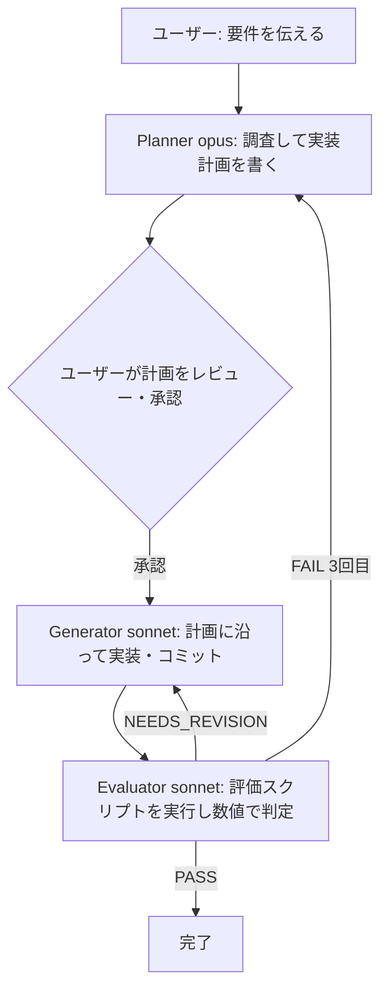
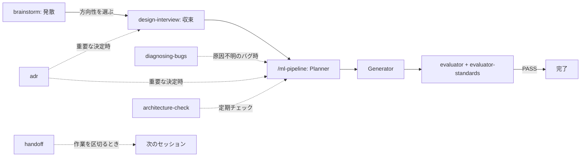

# claude-ml-template

Claude Code用の Planner / Generator / Evaluator 3分離パターンのテンプレート。

---

## 1. 全体像



3体に分けている理由は、1体に全部やらせると「計画・実装・自己採点」を同じ視点で行ってしまい、自分の間違いに気づけないため。役割ごとに視点を変えることで問題を検出しやすくする設計。

---

## 2. 各エージェントの役割と設定

| エージェント | ファイル | model | 持てるtools | 役割 |
|---|---|---|---|---|
| planner | `.claude/agents/planner.md` | `opus` | Read, Grep, Glob, Bash | 調査・計画立案のみ。コード変更はしない |
| generator | `.claude/agents/generator.md` | `sonnet` | Read, Write, Edit, Grep, Glob, Bash | 計画に沿って実装。`permissionMode: acceptEdits` で編集を自動承認 |
| evaluator | `.claude/agents/evaluator.md` | `sonnet` | Read, Grep, Glob, Bash | レビュー+評価コマンド実行。コードは書かない |
| evaluator-standards | `.claude/agents/evaluator-standards.md` | `sonnet` | Read, Grep, Glob, Bash | コード品質(Standards軸)のみレビュー。動作の正しさは判断しない |

### なぜこのモデル配分か

- Planner: 設計判断・原因分析など深い推論が必要 → Opus
- Generator: 定型的な実装作業、速度とコストのバランス重視 → Sonnet
- Evaluator: 読解と実行確認が中心、Opusほどの推論力は不要 → Sonnet
- 全部Haikuにすると計画品質が落ちる/全部Opusにするとコストが3〜5倍に跳ねるので、役割ごとに使い分けるのが基本方針

### permissionMode について

Claude Codeがファイル編集やコマンド実行の前にユーザー確認を挟むかどうかの設定。

| 値 | 動作 |
|---|---|
| `default`(未指定) | 破壊的操作は都度確認 |
| `acceptEdits` | ファイル編集だけ自動承認、それ以外は確認あり |
| `bypassPermissions` | ほぼ全操作を確認なしで実行(非推奨) |
| `plan` | 読み取り専用、変更は一切行わない |

Generatorだけ `acceptEdits` にしているのは、計画通りに黙々と実装させたいため。その代わり最終チェックはEvaluatorが必ず行う設計になっている。

---

## 3. 記事「よくある5つの失敗」への対策一覧

| # | 失敗内容 | 対策の実装場所 | 内容 |
|---|---|---|---|
| 1 | 指示が曖昧でサブエージェントが迷走 | `generator.md` 作業手順 | 実装前に「対象ファイルパス・使用ライブラリ・入出力の型/shape・制約条件」を確認するステップを追加 |
| 2 | 計画が細かすぎてGeneratorの自由度がない | `planner.md` 制約 | 「技術的詳細を詰めすぎない。実装の判断余地はGeneratorに残す」と明記 |
| 3 | Evaluatorが甘い | `evaluator.md` | PASS/FAIL二値判定のチェックリスト形式、「一度出した指摘を取り下げない」「ファイルパス+行番号で根拠を示す」 |
| 4 | フィードバックループが無限に回る | `ml-pipeline.md` | 最大3イテレーションで打ち切り、収束しなければPlannerからやり直し |
| 5 | モデル選択ミス | 各agent.md の `model` | Planner=opus, Generator=sonnet, Evaluator=sonnet |

---

## 4. 使い方(新プロジェクトで導入)

### 4-0. 全エージェント・スキル早見表

| 種別 | 名前 | 呼び出し方 | いつ使うか | 主な出力/効果 |
|---|---|---|---|---|
| Agent | planner | `/ml-pipeline` 内で自動、または `@planner` | 要件から実装計画を作りたいとき | `.claude/plans/` に計画ファイル |
| Agent | generator | `/ml-pipeline` 内で自動、または `@generator` | 計画に沿って実装したいとき | コード変更 + git commit |
| Agent | evaluator | `/ml-pipeline` 内で自動、または `@evaluator` | 実装が計画通り動くか確認したいとき(Spec軸) | PASS/NEEDS_REVISION/FAIL 判定 |
| Agent | evaluator-standards | `/ml-pipeline` 内で自動、または `@evaluator-standards` | コード品質を確認したいとき(Standards軸) | PASS/NEEDS_REVISION 判定 |
| Skill | brainstorm | 自然文、または「ブレストして」 | まだ方向性が定まっていないとき(発散) | `ideas/` にアイデア一覧 |
| Skill | design-interview | 自然文、または「grillして」「詰めて」 | ラフな設計書を固めたいとき(収束) | `docs/drafts/` の設計書を更新 |
| Skill | diagnosing-bugs | 自然文、または「原因を調べて」 | 原因不明のバグ・性能劣化を診断したいとき | 診断ログ、原因の特定 |
| Skill | tdd | 自然文、または「テスト駆動で」 | 入出力が明確な新機能をテストファーストで作りたいとき | red-green-refactorでの実装 |
| Skill | adr | 自然文、または「この決定をADRに残して」 | トレードオフを伴う設計判断を記録したいとき | `docs/adr/` にADR |
| Skill | handoff | 自然文、または「handoffして」「引き継ぎ作って」 | セッションや作業を区切って引き継ぎたいとき | `.claude/handoffs/` に引き継ぎ文書 |
| Skill | architecture-check | 自然文、または「アーキテクチャを見直して」 | 定期的に設計負債をチェックしたいとき | レポートのみ(コード変更なし) |

Agent と Skill の違いは、Agent は独立した作業を担う実行者(モデル・ツールを
個別指定)、Skill は今の会話に手順を差し込む補助的な振る舞い、という点。
詳しくは 7.6 節を参照。

### 典型的な使い方の流れ



すべてのステップを毎回踏む必要はない。すでに設計が固まっているなら
brainstorm や design-interview を飛ばして `/ml-pipeline` から始めてよい。

### 前提条件(Requirements)

| ツール | 用途 | 確認コマンド |
|---|---|---|
| uv | フックの実行(`uv run python`)・Python環境管理 | `uv --version` |
| git | テンプレート取得・バージョン管理 | `git --version` |
| Claude Code | 本体 | `claude --version` |

- フック(`.claude/hooks/`)はすべて `uv run python` 経由で動くため、uv が無い環境ではフックが機能しない。`claude-init` 実行時に uv/git の有無をチェックし、無ければ停止する。
- ruff は任意(auto_format 用)。無い場合は自動整形がスキップされるだけで、他は動く。

### 4-1. プロジェクトのルートで展開

**PowerShell(Windows)の場合:**

```powershell
Invoke-WebRequest -Uri "https://raw.githubusercontent.com/takayoshitoyoda05/claude-ml-template/main/claude-init.ps1" -OutFile "claude-init.ps1"
.\claude-init.ps1
```

**bash(WSL/Linux/Git Bash)の場合:**

```bash
curl -sO https://raw.githubusercontent.com/takayoshitoyoda05/claude-ml-template/main/claude-init.sh
chmod +x claude-init.sh
./claude-init.sh
```

展開すると `.claude/agents/`, `.claude/commands/`, `.claude/hooks/`, `.claude/settings.json`, `CLAUDE.md`(共通ルールのみ)が作られる。対話質問はなく一瞬で完了する。評価コマンドやモデルの場所など各プロジェクト固有の情報は、そのプロジェクト直下の `CLAUDE.md` に記載する(例: `projects/Deep_MIL/CLAUDE.md`)。

### 4-2. 動作確認

```powershell
claude
```

`/agents` コマンドが使える環境ならそこで一覧確認できる。使えない場合はセッション内でこう尋ねる:

```
どんなサブエージェントが使える?
```

planner / generator / evaluator の3体が認識されていればOK。

### 4-3. 実行

```
/ml-pipeline <作業ディレクトリ> <やりたいこと>
```

作業ディレクトリを冒頭で指定することで、その配下だけを対象に3エージェントが動く。複数プロジェクトが1つのリポジトリに同居している場合でも、他プロジェクトや `papers/` `slides/` などを誤って触らないようにするための仕組み。

例:

```
/ml-pipeline projects/Deep_MIL attention可視化のバグを直したい。
outputs/に出る画像が真っ黒になる問題を解消したい
```

作業ディレクトリを指定しなかった場合、エージェントは着手前に「どのプロジェクトディレクトリで作業するか」を確認する。

### 4-4. 個別に呼び出したい場合

```
@planner この関数の設計を考えて
@generator この計画通りに実装して
@evaluator 直近の変更をレビューして
```

---

### 4-4-1. アイディアを広げたい場合(brainstorm スキル)

まだ方向性が定まっていない段階で、選択肢を広く出したいときに使う。

### 4-5. 設計書を渡す場合

事前に書いた設計書(docs/配下)を元に計画を作らせたい場合は、そのファイルパスを
指定してパイプラインを実行する。
/ml-pipeline projects/Deep_MIL docs/drafts/20260703_attention_mil.md の設計書に沿って実装したい

Planner は以下を自動で行う。

1. docs/drafts/, docs/active/, docs/archive/ が無ければ作成する
2. 渡された設計書が docs/drafts/ にあれば docs/active/ へ移動してから計画を作成する
3. 計画ファイルの先頭に、参照した設計書のパスを記録する

Evaluator が PASS を出すと、参照された設計書は docs/active/ から
docs/archive/YYYYMMDD_<元のファイル名> に自動で移動される。

この仕組みにより、「今検討中の設計書(drafts)」「今まさに実装中の設計書(active)」
「完了・ボツになった設計書(archive)」が自然に整理され、docs/ が無秩序に
散らからない。

### 4-5. 設計を深掘りしたい場合(design-interview スキル)

docs/drafts/ に書いたラフな設計書を、実装に入る前に一問一答形式で
詰めたい場合に使う。
このdocs/drafts/xxx.mdの設計をgrillして

または自然に「この設計、詰めてもらえる?」のように頼んでもよい。
1問ずつ質問され、それぞれに推奨案が添えられる。すべて解消されると
設計書が更新され、Planner に渡す準備が整う。

これは Skills 機能(.claude/skills/design-interview/)であり、
サブエージェントとは別の仕組み。プロジェクトディレクトリで claude を
起動してから使うこと(スコープ保護のため)。

## 5. 運用サイクル(育て方)

1. 実プロジェクトで `/ml-pipeline` を使う
2. 「Plannerの指示がずれていた」「Generatorが暴走した」「Evaluatorが甘かった」など気づきが出る
3. 気づきを **このテンプレートリポジトリ側** の該当 `.md` に反映して commit・push
4. 次の新規プロジェクトでは改善版がすぐ使える

プロジェクト固有の調整(そのプロジェクトだけの特殊事情)は、展開後のローカル `.claude/` だけを直接編集し、テンプレート側には戻さない。テンプレートに戻すのは「他のプロジェクトでも共通して使える改善」のみ、と切り分けるのがコツ。

### プロジェクト側を最新テンプレートに更新する

初回展開後、テンプレート側(このリポジトリ)を更新したら、各プロジェクトで以下を実行すると `agents` / `commands` / `hooks` / `settings.json` だけが最新化される。`.claude/plans/`(実行履歴)と `CLAUDE.md`(プロジェクト固有)は変更されない。

**PowerShell:**

```powershell
Invoke-WebRequest -Uri "https://raw.githubusercontent.com/takayoshitoyoda05/claude-ml-template/main/claude-update.ps1" -OutFile "claude-update.ps1"
.\claude-update.ps1
```

**bash:**

```bash
curl -sO https://raw.githubusercontent.com/takayoshitoyoda05/claude-ml-template/main/claude-update.sh
chmod +x claude-update.sh
./claude-update.sh
```

---

## 6. コスト感覚

- 3エージェント構成は単一実行より確実にトークン消費が増える(数倍〜十数倍になり得る)
- 向いているタスク: 結果の正しさが重要、複数バージョン間のdiscrepancy解消、実験の再現性がかかった変更
- 向いていないタスク: 単発のリファクタ、文献確認、ドキュメント編集など軽い調査タスク → メインセッションだけで十分

判断に迷ったら「これが間違っていたら困るか?」を基準にする。困るなら3エージェント、困らないなら単発でOK。

---

## 7. トラブルシューティング

### 文字化け

原因: エディタ(nvim)のファイルエンコーディング設定がUTF-8になっていない。

対策:

- 編集前に必ず `:set fileencoding=utf-8` と `:set fileformat=unix` を実行
- 既に化けたファイルを開いても正しく直らないので、一度PowerShellの `Out-File -Encoding utf8` または `[System.IO.File]::WriteAllText(...)` で書き直す方が確実
- `.sh` ファイルはBOM付きUTF-8だとシェバン(`#!/bin/bash`)が壊れて実行できなくなるので、BOMなしUTF-8で保存する
- リポジトリに `.gitattributes` を置いて `*.sh` `*.py` を `eol=lf` に固定しておくと、環境をまたいでも改行コード事故が起きない

### PowerShellで `mkdir -p a b c` のようなbash構文がエラーになる

PowerShellの `mkdir` は複数パスを一度に取れない。代わりに:

```powershell
New-Item -ItemType Directory -Path "a", "b", "c" -Force
```

### git pushでブランチ名がmasterのままになる

```powershell
git branch -M main
```

で明示的にmainへ変更してからpush。

### Get-Content で日本語が化けて見える

原因: PowerShell 5.1系の `Get-Content` はBOMなしUTF-8ファイルを既定でANSI(Shift-JIS)として読み込むことがある。ファイル自体は壊れていないことが多い。

対策:

```powershell
Get-Content ファイル名 -Encoding UTF8
```

---

## 7.5 フックによる堅牢化(自動ガード)

プロンプトによる「お願い」ではなく、確定的に実行されるフックで以下を強制する。フックは `.claude/hooks/` に置き、`.claude/settings.json` で配線される。全フックは `uv run python` 経由で実行するため、Windows/Mac/Linux で同一に動作する。

| フック | イベント | 役割 |
|---|---|---|
| guard_scope.py | PreToolUse (Edit/Write) | スコープ外・生成物(`.pth`, `checkpoints/`等)への書き込みを物理ブロック |
| guard_bash.py | PreToolUse (Bash) | `rm -rf` 等の危険コマンド、大容量ファイルの `git add` をブロック |
| auto_format.py | PostToolUse (Edit/Write) | `.py` 編集後に `ruff format` を自動実行(ruff が無ければスルー) |
| enforce_eval.py | Stop | 評価コマンドを実行し、失敗なら続行を促す(フラグON時のみ) |

これはプロンプト側のスコープ制約(各エージェント定義に記載)と二重防御の関係にある。プロンプトで意図を伝え、フックで物理的に最終ブロックする。

### 制御用の環境変数(claude 起動前に設定)

| 変数 | 意味 | 例 |
|---|---|---|
| CLAUDE_WORK_SCOPE | 書き込み許可範囲。未設定ならカレントディレクトリ | `projects/Deep_MIL` |
| CLAUDE_ENFORCE_EVAL | 1 のとき評価強制ON | `1` |
| CLAUDE_EVAL_CMD | 評価強制で実行するコマンド | `uv run python -m pytest projects/Deep_MIL/tests/ -q` |

起動例(PowerShell):

```powershell
$env:CLAUDE_WORK_SCOPE = "projects/Deep_MIL"
$env:CLAUDE_ENFORCE_EVAL = "1"
$env:CLAUDE_EVAL_CMD = "uv run python -m pytest projects/Deep_MIL/tests/ -q"
claude
```

起動例(bash):

```bash
export CLAUDE_WORK_SCOPE="projects/Deep_MIL"
export CLAUDE_ENFORCE_EVAL="1"
export CLAUDE_EVAL_CMD="uv run python -m pytest projects/Deep_MIL/tests/ -q"
claude
```

### 無効化

`.claude/settings.json` に `"disableAllHooks": true` を追加するか、環境変数を設定せずに起動する(評価強制はOFFになる)。

### 前提と速度

全フックは uv に依存する(`uv run python` で実行)。全環境に uv がある前提。速度が気になる場合、高頻度の guard_scope/guard_bash のみ将来 bash へ移植する余地がある。

---

## 7.6 品質向上の追加施策

mattpocock/skills (https://github.com/mattpocock/skills) の考え方を参考に
翻案・追加した施策。

### Evaluatorの二軸分割(Spec / Standards)
以前は evaluator 1体が「動作の正しさ」と「コード品質」を両方判定していたが、
互いの判断が薄まらないよう2体に分割した。

- evaluator: 計画通りに動作するか(Spec)。評価スクリプトの実行結果で判定。
- evaluator-standards: コーディング規約・可読性・型安全性(Standards)。

/ml-pipeline は両方を独立に実行し、両方PASSして初めて完了とする。

### diagnosing-bugs スキル
原因不明のバグを「再現→最小化→仮説→計測→修正→回帰テスト」の手順で
診断するスキル。「原因を調べて」「なぜこうなるか分からない」で自動的に、
または明示的に呼び出せる。憶測でコードを直すことを防ぐ。

### CONTEXT.md(ドメイン用語集)
プロジェクト特有の用語のブレを防ぐため、プロジェクト直下に CONTEXT.md を
置く運用。全エージェント・design-interview スキルが、作業開始前にこの
ファイルがあれば読むよう構成されている。雛形は templates/CONTEXT.md.template
を参照し、必要なプロジェクトの直下にコピーして育てる
(例: projects/Deep_MIL/CONTEXT.md)。claude-init では自動配布されない
(プロジェクトごとに内容が異なるため)。

## 7.7 品質・堅牢性のさらなる強化(優先度B/C/D)

### スキル追加
| スキル | 用途 |
|---|---|
| tdd | 新規機能をred-green-refactorのテストファーストで実装する |
| adr | 設計上の重要な決定を docs/adr/ に記録する |
| handoff | 長い会話を引き継ぎ文書にまとめ、別セッション/別マシンで再開できるようにする |
| architecture-check | コードベース全体の設計負債(重複・肥大化・命名不一致)を定期チェックする |

### フックの強化
- guard_scope.py / guard_bash.py が、.env・credentials.json・秘密鍵ファイル・
  APIキーらしき文字列の書き込みやgit addを物理的にブロックするようになった。
- generatorのコミットメッセージにステップ番号(数字)が無い場合、
  パイプライン実行中(CLAUDE_ENFORCE_EVAL=1)に限りブロックされる。

### verify-hooks(フックの自動テスト)
push前にフックが正しく動くか一括確認できる。

PowerShell: `.\verify-hooks.ps1`
bash: `./verify-hooks.sh`

全テストPASSしてから push することを推奨する。

### 実験ログとbaseline
Evaluatorが PASS を出すたびに docs/EXPERIMENT_LOG.md に変更内容と指標の
変化を自動記録する。主要指標は docs/baselines/history.md に追記するか
都度確認される。論文の実験セクション執筆時に遡って参照できる。

### Explore事前調査
Plannerは、調査範囲が広い場合まず Explore サブエージェント(Haiku)に
大まかな調査をさせてから自分の調査を絞り込む。Opusのトークン消費を抑える。

## 8. ファイル一覧

```
claude-ml-template/
  .claude/
    agents/
      planner.md        Opus / 計画立案専任
      generator.md       Sonnet / 実装専任、acceptEdits
      evaluator.md        Sonnet / レビュー・数値検証専任
    commands/
      ml-pipeline.md      3エージェントを繋ぐフロー制御
    hooks/
      guard_scope.py      スコープ外・生成物への書き込みブロック
      guard_bash.py        危険コマンド・大容量git addブロック
      auto_format.py       ruff format自動実行
      enforce_eval.py       評価コマンド実行強制
    settings.json          フックの配線
  templates/
    CLAUDE.md.template     プロジェクト展開時に埋められる雛形
  claude-init.ps1          Windows PowerShell用 初回セットアップ
  claude-init.sh           Linux/WSL/Git Bash用 初回セットアップ
  claude-update.ps1        Windows PowerShell用 更新スクリプト
  claude-update.sh         Linux/WSL/Git Bash用 更新スクリプト
  .gitattributes           改行コード固定(*.sh, *.pyをLFに)
  README.md
```
